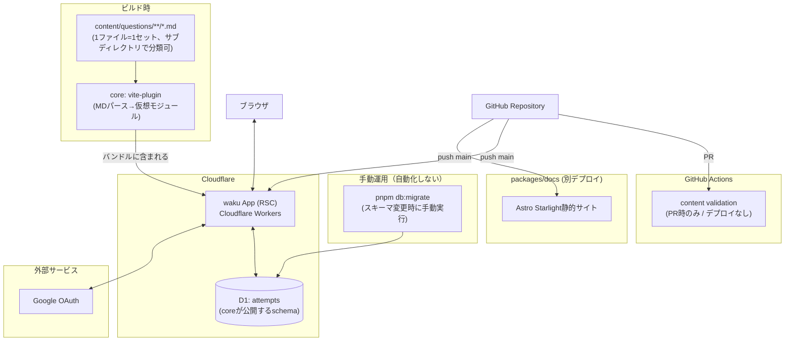
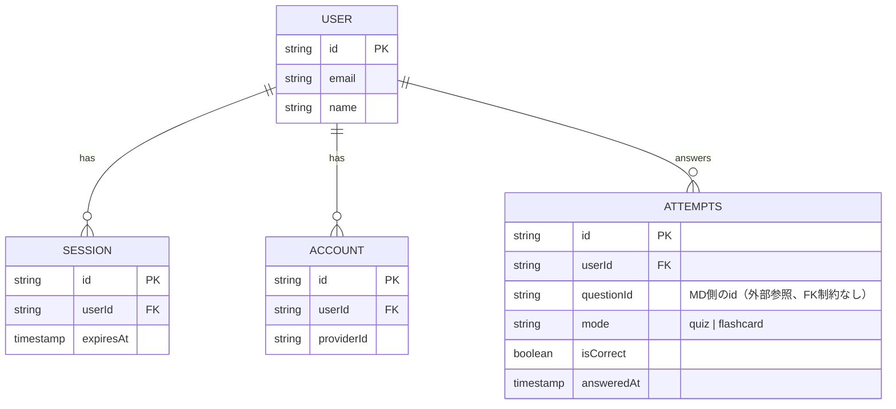
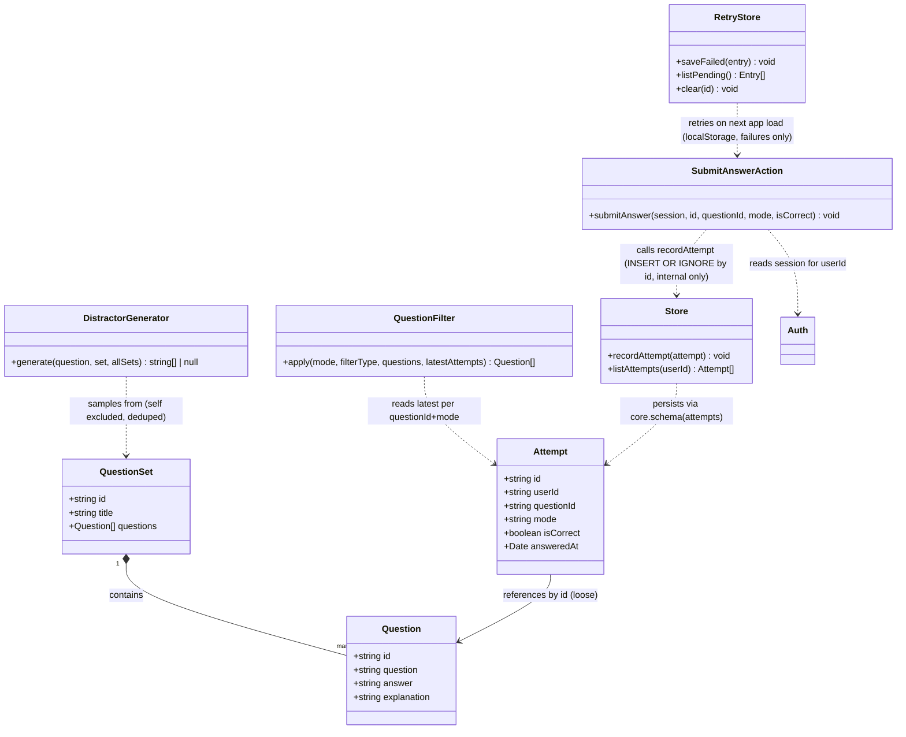
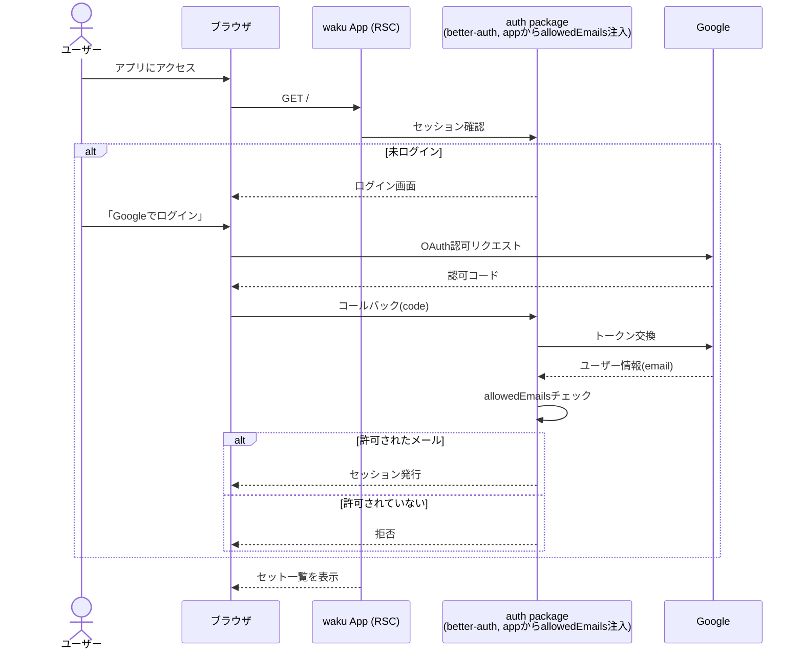
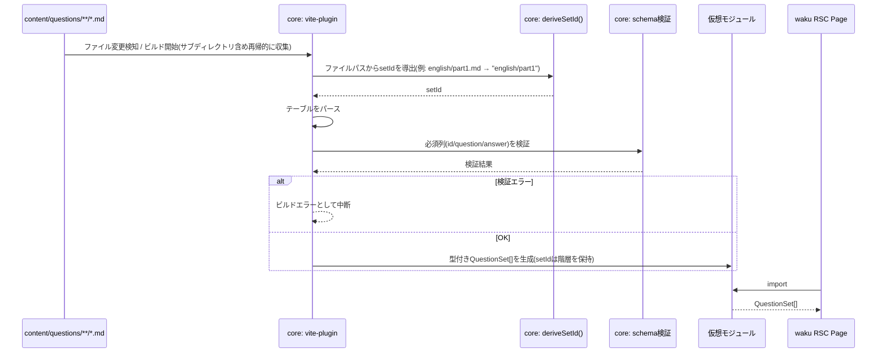
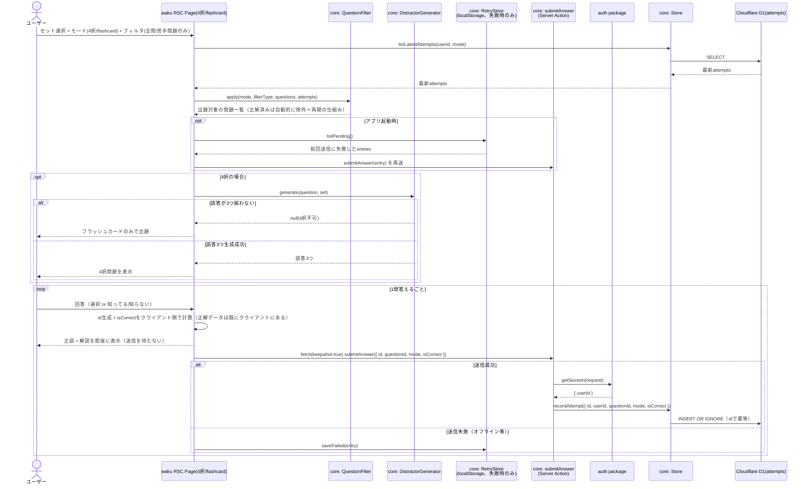

# 基本設計書 (v0.1)

対象: [SPEC.md](./SPEC.md) で確定した仕様のUML図。

## 1. システム構成図

D1マイグレーションは本体アプリの自動デプロイ経路に含めない。スキーマ変更時のみ、開発者が`pnpm db:migrate`を手動実行してからコードをpushする（4章参照）。

## 2. モノレポ構成図

better-authの設計を参考に、`core`がDrizzleスキーマとStore実装を公開し、`db`/`auth`はその上で「自分が使いやすいように」組み立てるパッケージという位置づけにする。

```mermaid
graph TD
    Root["quiz-app/"]
    Root --> Core["packages/core<br/>(フレームワーク本体)"]
    Root --> Db["packages/db<br/>(D1接続・マイグレーション、自分用)"]
    Root --> Auth["packages/auth<br/>(better-auth設定、自分用)"]
    Root --> Cli["packages/cli<br/>(アプリ雛形・セット雛形の生成)"]
    Root --> Templates["packages/templates/default<br/>(quiz createがコピーする実パッケージ)"]
    Root --> App["packages/app<br/>(自分の本番アプリ)"]
    Root --> Docs["packages/docs<br/>(Astro Starlight)"]

    Core --> C1["content/ MDパーサー・スキーマ検証・deriveSetId()"]
    Core --> C2["vite-plugin/ 仮想モジュール化"]
    Core --> C3["distractors/ 誤答生成"]
    Core --> C4["filters/ 出題フィルタ(全問/苦手問題のみ)"]
    Core --> C5["pages/ waku RSCページ（カスタマイズ可）"]
    Core --> C6["schema.ts 公開Drizzleスキーマ(attempts)"]
    Core --> C7["store.ts schemaに対応するStore実装"]
    Core --> C10["actions/ submitAnswer(1問ごと即時) Server Action"]
    Core ==依存==> Auth

    Db --> D1S["schema.ts core.attempts + better-auth生成スキーマを統合"]
    Db --> D1M["migrations/ drizzle-kit生成（唯一の適用先）"]
    Db --> D1C["client.ts D1接続の組み立て"]
    Db -.importする.-> C6

    Auth --> A1["auth.ts better-auth + Google + allowlist"]
    Auth -.スキーマはdbが取り込む.-> D1S

    Cli --> CL1["create-app.ts `quiz create <name>` : templates/defaultをコピー"]
    Cli --> CL2["new-set.ts `quiz new <name>` : content/questions/にMD雛形を生成(階層可)"]
    Cli -.コピー元.-> Templates

    Templates --> T1["waku.config.ts (quizContentPluginを直接登録)"]
    Templates --> T3["wrangler.toml"]
    Templates --> T2["content/questions/example.md"]
    Templates -.依存(型チェック対象).-> Core
    Templates -.依存(型チェック対象).-> Auth
    Templates -.依存(型チェック対象).-> Db

    App --> AP2["content/questions/**/*.md (階層可、例: english/part1.md)"]
    App --> AP3["waku.config.ts (quizContentPluginを直接登録)"]
    App --> AP4["wrangler.toml"]

    App -.依存.-> Core
    App -.依存.-> Db
    App -.依存.-> Auth
    Docs -.参照.-> SpecFiles["SPEC.md / DESIGN.md"]
```

## 3. ER図（D1）

問題データはD1に持たない。ユーザーの学習記録(`attempts`、`core`が公開するスキーマ)とbetter-auth標準テーブル(`auth`パッケージが管理)のみ。

`db`パッケージは`ATTEMPTS`とbetter-auth標準テーブル(`USER`/`SESSION`/`ACCOUNT`)を1つの`schema.ts`にまとめ、単一のマイグレーション履歴で管理する（別々のマイグレーションフローにしない）。

## 4. クラス図（coreのドメインモデル）

- `Store`は`core/src/schema.ts`で公開される`attempts`テーブルに対して直接動く（DB非依存の抽象インターフェースにはしない）。`db`パッケージは`Store`を満たすDrizzle接続を組み立てて`app`に渡すだけの役割。
- `Store.recordAttempt`は`SubmitAnswerAction`の内部からのみ呼ばれる。クライアントが直接呼び出せるAPIとしては公開しない。`id`はクライアント生成で、`INSERT OR IGNORE`により再送しても重複しない(冪等)。
- `isCorrect`はクライアント側で計算する（正解データは`QuestionSet`としてクライアントにも渡っているため、サーバー側で独立に再判定しない）。目的は改ざん防止ではなく、正誤の永続化と途中離脱からの再開。`userId`だけはサーバー側セッションから取得する。
- 4択・フラッシュカードとも同じ`SubmitAnswerAction`経路を通る（判定方法だけが異なり、記録経路は1本化されている）。バッチ化はせず1問ごとに`fetch(keepalive: true)`で即時送信し、失敗時のみ`RetryStore`(localStorage)に退避する。
- `RetryStore`のキーはログイン中の`userId`で名前空間化する(`retryQueue:${userId}`)。同じブラウザで別ユーザーがログインしても別の名前空間を見るため、他人の未送信回答と混ざらない。

## 5. シーケンス図: ログイン（Google OAuth + allowlist）

## 6. シーケンス図: コンテンツビルドパイプライン

## 7. シーケンス図: 出題〜記録（4択・フラッシュカード共通、即時送信）

目的は「サーバー側での厳密な正誤判定」ではなく、**(a)正誤の永続化**と**(b)途中離脱からの再開**。4択・フラッシュカードとも同じ記録経路(クライアント側で判定 → 即時送信 → 失敗時のみlocalStorageへ退避)に統一する。バッチ化はしない。

`isCorrect`はクライアントが計算するが、`userId`は必ずサーバー側セッションから取得するため、記録が「誰の」ものかは偽装できない。次回セットを開いたとき、`listLatestAttempts`が既に正解した問題を除外するので、特別なセッション状態を持たなくても途中離脱からの再開になる。
