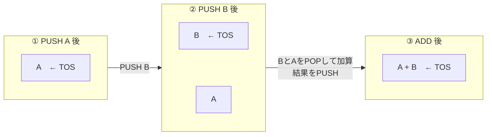
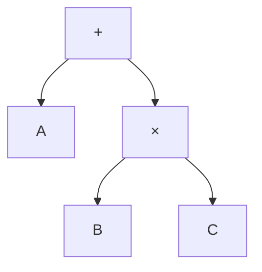
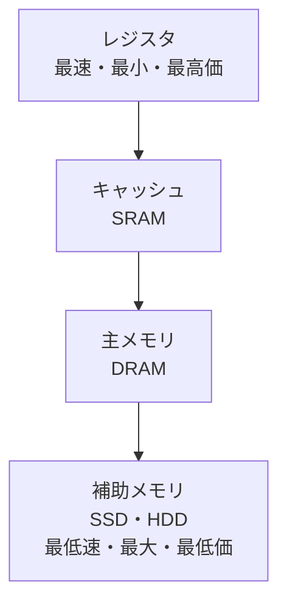
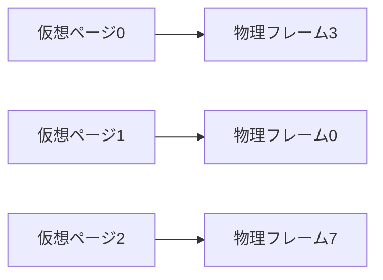
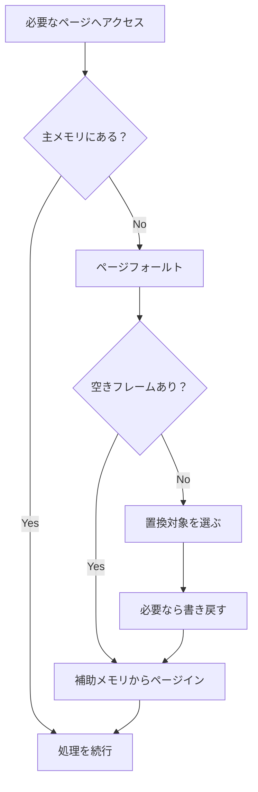

# このカンペの使い方

この資料は、試験直前の暗記だけでなく、授業内容を最初から総復習できるように構成している。

| 残り時間 | 読む場所 |
|---:|---|
| 5分 | 「0. 最初の3分」「7. 弱点専用」「9. 60秒最終暗記」 |
| 30分 | 各章の表・図・計算テンプレート |
| 1〜2時間 | 第1章から順番に読み、セルフテストを解く |
| それ以上 | 総復習問題を自力で解き、模範解答で修正する |

## 授業資料との対応

| このカンペ | 主な`data/CA` | 内容 |
|---|---|---|
| 第1章 | `01`, `02` | ノイマン型、CPU、バス、命令実行 |
| 第2章 | `03`, `14`, `04`, `05`, `06`, `07`, `08` | ISA、命令形式、CISC/RISC |
| 第3章 | `15`, `09`, `10`前半 | CPU性能評価 |
| 第4章 | `10`後半, `11` | メモリ分類・記憶媒体 |
| 第5章 | `12`, `13` | メモリ階層・キャッシュ |
| 第6章 | `13` | ページング・置き換え |

この授業ではシラバスの順番と実際の進行が一致しないため、録画・ノートで実際に扱われた内容を優先している。

### 本格的な説明が確認できず、原則として除外したもの

- キャッシュのダイレクト／セットアソシアティブ等のマッピング
- ライトスルー／ライトバック等の更新方式
- TLB
- セグメンテーション
- DMA・I/Oチャネル等の詳細な入出力方式
- 相互結合網・並列マシン分類

# 0. 最初の3分で見るページ

## 最重要6項目

### ノイマン型の2大原理

1. **2進数演算**
2. **プログラム内蔵方式**\
   プログラムを命令列としてメモリに格納し、プロセッサが読み出して実行する。

> 表記は「内**蔵**」。内臓ではない。

### ノイマン型の4特徴

1. プロセッサとメモリという機能単位
2. 逐次実行
3. 基本命令セット
4. 線形メモリ

### CPU時間

$$
T_{\mathrm{CPU}}=IC\times CPI_{\mathrm{avg}}\times TPC
$$

$$
TPC=\frac{1}{f},\qquad
\text{総クロックサイクル数}=IC\times CPI
$$

$$
\text{高速化率}
=
\frac{T_{\mathrm{old}}}{T_{\mathrm{new}}}
$$

### メモリの3つの分類軸

| 分類軸 | 用語 | 問い |
|---|---|---|
| 保存性 | 揮発性／不揮発性 | 電源を切ると消えるか |
| 読み書き特性 | RWM／ROM | 通常の利用で書き換えられるか |
| アクセス特性 | RAM／SAM | 任意位置へ直接アクセスできるか |

> ROMとRAMは反対語ではない。分類軸が違う。

### メモリ階層

$$
\text{レジスタ}
\rightarrow
\text{キャッシュ}
\rightarrow
\text{主メモリ}
\rightarrow
\text{補助メモリ}
$$

- 左ほど高速・小容量・高価
- 右ほど低速・大容量・安価

### キャッシュ計算

$$
\beta=\frac{H}{H+M},\qquad
\text{ミス率}=1-\beta
$$

授業で使う平均アクセス時間：

$$
T_a=\beta T_c+(1-\beta)T_m
$$

$$
S=\frac{T_m}{T_a}
$$

---

# 1. 基本アーキテクチャ

## プロセッサとメモリ

- **プロセッサ**：命令をフェッチ・解釈・実行する
- **メインメモリ**：実行中の命令とデータを保持する
- **バス**：複数の構成要素が共有する信号線の束
- **ファイル装置／補助メモリ**：プログラムとデータを長期・大量に保存する

補助メモリ上のプログラムは、そのままでは実行しない。


## フォン・ノイマン・ボトルネック

プロセッサが高速でも、メモリから命令・データがバス経由で届かなければ待ちが発生する。

> プロセッサとメモリ間の転送能力が、コンピュータ全体の性能を制限すること。

## プロセッサ内部


| 部分 | 保持・実行するもの | 覚え方 |
|---|---|---|
| PC | 次にフェッチする命令のアドレス | 次は**どこ** |
| MAR | 今回アクセスするメモリアドレス | メモリの**どこ** |
| IR | 現在処理中の命令 | 今の命令は**何** |
| デコーダ | 命令の意味を解釈 | 何をする命令か |
| 制御機構 | 各部へ制御信号を出す | いつ、どれを動かすか |
| レジスタ | オペランド・途中結果・アドレス | 高速な作業台 |
| ALU | 算術演算・論理演算 | 実際に計算する場所 |

> IRはコンパイラのIntermediate Representationではなく、ここではInstruction Register。

## 命令実行サイクル

1. **命令フェッチ**：PCが示すアドレスから命令を取得
2. **命令デコード**：命令の種類を解釈
3. **オペランドフェッチ**：演算対象をレジスタ／メモリから取得
4. **実行**：ALUなどが処理
5. **書き戻し**：結果をレジスタ／メモリへ格納


## PCの更新

分岐がない通常の場合：

$$
PC_{\mathrm{next}}=PC_{\mathrm{current}}+\text{命令語長}
$$

条件分岐が成立した場合：

$$
PC_{\mathrm{next}}=\text{分岐先アドレス}
$$

### アドレスと容量

「各アドレスに1バイト格納できる」とは、アドレスそのものを1バイトに保存する意味ではない。

```text
アドレス0    → 1バイト
アドレス1    → 1バイト
...
アドレス8191 → 1バイト
```

$$
0\text{から}N\text{までの個数}=N+1
$$

$$
8192\text{アドレス}\times1\text{B}=8192\text{B}=8\text{KiB}
$$

- 1バイト = 8ビット
- 1KiB = 1024バイト
- 1本の信号線は基本的に1ビットを伝える
- 命令は1バイトとは限らず、複数バイトの場合がある

## ALU

- 算術演算：加算・減算・乗算・除算
- 論理演算：AND・OR・NOT・XOR

同じ$N$ビットでも扱いが異なる。

- 算術演算：$N$ビット全体を1個の数値として扱う
- 論理演算：1ビットの論理値が$N$個並んだものとして扱う

## マルチコア

- **マルチコア**：1つのCPUチップ内に複数の処理コア
- **マルチプロセッサ**：1つのシステムに複数のプロセッサを持つ広い概念
- 各コア内部では、基本的な命令実行サイクルを行う
- 処理依存関係があると完全並列化できない
- メモリやバスがボトルネックになることもある

---

# 2. 命令セットアーキテクチャ・CISC・RISC

## ISA

ISA（Instruction Set Architecture）は、ソフトウェアから見えるプロセッサの仕様。

- 使用できる命令
- 命令形式
- レジスタ
- オペランドの置き場所
- メモリアクセス方法
- アドレッシング方法

### 命令語

```text
命令語
├── オペコード：何をするか
└── オペランド：何を使い、どこへ結果を置くか
```

例：

```text
ADD R3, R1, R2
```

- オペコード：`ADD`
- オペランド：`R3`, `R1`, `R2`
- 意味：$R3\leftarrow R1+R2$

## 明示的・暗黙的オペランド

- **明示的**：命令語に対象を書く
- **暗黙的**：命令語には書かないが、ISAの規則で対象が決まる

```text
ADD R3, R1, R2  // 3つを明示
ADD             // スタックトップ2個を使うことが暗黙
```

> 暗黙的とは「どの値か不明」ではない。規則によって一意に決まる。

## ISAの4分類

| 方式 | 主なオペランド位置 | 暗黙の場所 | $C=A+B$の例 |
|---|---|---|---|
| スタック型 | スタック | スタックトップ | `PUSH A; PUSH B; ADD; POP C` |
| アキュムレータ型 | ACC＋メモリ | ACC | `LOAD A; ADD B; STORE C` |
| レジスタ・メモリ型 | レジスタ＋メモリ | 基本なし | `LOAD R1,A; ADD R1,B; STORE C,R1` |
| レジスタ・レジスタ型 | レジスタ | 基本なし | `LOAD R1,A; LOAD R2,B; ADD R3,R1,R2; STORE C,R3` |

### 4方式の違いを一段深く

| 方式 | 典型的なアドレス数 | ALU命令はどこを読むか | $A+B$の結果が最初に置かれる場所 | この例の命令数 |
|---|---:|---|---|---:|
| スタック型 | 0 | スタックトップの2値 | スタックトップ | 4 |
| アキュムレータ型 | 1 | ACCと、命令で指定した値 | ACC | 3 |
| レジスタ・メモリ型 | 2 | レジスタと、レジスタまたはメモリ | 指定したレジスタ | 3 |
| レジスタ・レジスタ型 | 3 | レジスタ同士のみ | 指定したレジスタ | 4 |

> **アドレス数は、命令中に明示するオペランド位置の数。**\
> メモリのアドレスが0番地・1番地・2番地・3番地という意味ではない。

#### 1. スタック型

```text
PUSH A   // Aをスタックへ積む
PUSH B   // Bをスタックへ積む
ADD      // AとBをPOPし、A+BをPUSH
POP C    // 結果をCへ保存
```



- `ADD`の命令中には演算対象を書かない
- 対象は「スタックトップの2値」と規則で決まる
- 命令は短くできるが、途中値がどこにあるか追いにくい
- 後置記法（RPN）と相性がよい

#### 2. アキュムレータ型

```text
LOAD A   // ACC ← M[A]
ADD B    // ACC ← ACC + M[B]
STORE C  // M[C] ← ACC
```

- ACCが暗黙の入力兼出力
- 命令には、もう一方のオペランドだけを書けばよい
- 命令数・命令長を抑えやすい
- ACCへ処理が集中し、並列に複数の途中結果を保持しにくい

#### 3. レジスタ・メモリ型

```text
LOAD R1,A    // R1 ← M[A]
ADD R1,B     // R1 ← R1 + M[B]
STORE C,R1   // M[C] ← R1
```

- `ADD R1,B`のように、ALU命令がメモリ`B`を直接読める
- この例では`B`専用のLOADを省ける
- 命令数を減らしやすい
- ALU命令ごとにメモリアクセスの有無が変わり、命令実行が複雑になりやすい
- CISCで典型的に見られる考え方

#### 4. レジスタ・レジスタ型

```text
LOAD R1,A       // R1 ← M[A]
LOAD R2,B       // R2 ← M[B]
ADD R3,R1,R2    // R3 ← R1 + R2
STORE C,R3      // M[C] ← R3
```

- ALU命令はレジスタだけを読む
- メモリへ触れるのは原則`LOAD`と`STORE`だけ
- 命令数は増えやすいが、各命令の動作が単純で規則的
- パイプライン化や高速なデコードに向く
- RISCの典型であり、**ロード・ストア型**ともいう

### 最短識別法

```text
ADDだけ                  → スタック型
ADD B                    → アキュムレータ型（ACCが省略）
ADD R1,B                 → レジスタ・メモリ型
ADD R3,R1,R2             → レジスタ・レジスタ型
```

### 試験で書くべき比較

| 比較点 | 暗黙の場所が多い側 | 明示する場所が多い側 |
|---|---|---|
| 命令語 | 短くなりやすい | 長くなりやすい |
| 命令単体の読みやすさ | 低くなりやすい | 高くなりやすい |
| 命令数 | 必ず少ないとは限らない | 必ず多いとは限らない |
| 制御 | 複雑になる場合がある | 規則化しやすい場合がある |

> **重要：命令数だけで性能を決めない。**\
> CPU時間は $IC\times CPI\times T_{PC}$ なので、命令数が少なくてもCPIが大きければ遅くなり得る。

> 命令名やオペランドの並び順はISAによって異なる。この表では授業中の抽象的な表記を使っている。

### アドレス形式

0・1・2・3は、命令中に明示するオペランド位置の数。

```text
ADD               // 0アドレス
ADD A             // 1アドレス
ADD R1, A         // 2アドレス
ADD R3, R1, R2    // 3アドレス
```

## スタック関連

- LIFO：Last In, First Out
- PUSH：スタックトップへ追加
- POP：スタックトップから取得・削除
- TOS：Top of Stack

## 数式の記法と木の走査

| 記法 | 演算子の位置 | $A+B$ |
|---|---|---|
| 前置記法 | 前 | `+ A B` |
| 中置記法 | 中 | `A + B` |
| 後置記法／RPN | 後 | `A B +` |

> Lispで典型的なのは前置形式。RPNは後置形式。



$A+B\times C$の場合：

- pre-order（親→左→右）：`+ A × B C`
- in-order（左→親→右）：`A + B × C`
- post-order（左→右→親）：`A B C × +`

## CISCとRISC

| 観点 | CISC | RISC |
|---|---|---|
| 正式名 | Complex Instruction Set Computer | Reduced Instruction Set Computer |
| 代表 | x86-64 | ARM・RISC-V |
| 1命令 | 複雑になりやすい | 単純・規則的 |
| 命令長 | 可変長になりやすい | 固定長・規則的になりやすい |
| メモリアクセス | ALU命令から可能な場合がある | LOAD・STOREへ分離 |
| IC | 小さくなりやすい | 大きくなりやすい |
| CPI・制御 | 複雑になりやすい | 小さく・単純にしやすい |

現代x86-64は、外から見えるISAはCISCだが、内部で複雑な命令を単純なマイクロオペレーションへ分解することがある。

### ロード・ストア型

```text
メモリ --LOAD--> レジスタ
レジスタ --ALU演算--> レジスタ
レジスタ --STORE--> メモリ
```

利点：

- 命令形式が規則的
- 制御・デコードを単純化しやすい
- パイプライン化しやすい

欠点：

- LOAD・STORE分だけICが増える可能性
- 多くのレジスタが必要
- レジスタ割り当てが重要

## 基本命令の分類

- 算術：ADD, SUB, MUL, DIV
- 論理：AND, OR, NOT, XOR
- ビット列操作：シフト、ローテート、セット、クリア
- データ転送：MOV, LOAD, STORE, PUSH, POP
- 制御：条件分岐、無条件分岐、CALL, RETURN
- 特権命令：OSだけが実行できる命令
- SVC：アプリケーションがOSへ特権処理を依頼する仕組み

### セマンティックギャップ

高級言語と機械語の抽象度・意味の差。コンパイラが段階的な変換で埋める。

```text
ソース → AST → IR → 機械依存IR → 機械語
```

---

# 3. CPU性能の定量的評価

## 時間の区別

- **Elapsed Time / Wall Clock Time**：開始から終了まで現実に経過した時間
- **CPU時間**：対象プログラムの処理にCPUが実際に使った時間

$$
CPU時間\leq Elapsed Time
$$

Elapsed TimeにはI/O待ち、他プロセスの実行などが含まれる。

## 4つの量を混同しない

| 用語 | 意味 | 単位 |
|---|---|---|
| IC | 実行命令数 | 命令 |
| CPI | 1命令当たり平均サイクル数 | cycle/instruction |
| TPC | 1サイクルの時間 | second/cycle |
| $f$ | 1秒当たりのサイクル数 | cycle/second = Hz |

$$
TPC=\frac{1}{f}
$$

単位で式を確認：

$$
\text{命令}
\times
\frac{\text{サイクル}}{\text{命令}}
\times
\frac{\text{秒}}{\text{サイクル}}
=
\text{秒}
$$

### CPIの意味

- CPI = 1：平均1サイクルで1命令完了
- CPI = 2：平均1命令に2サイクル
- CPI = 0.5：平均1サイクル当たり2命令完了

> CPIは周波数ではない。

## 単位換算

$$
1\mathrm{MHz}=10^6\mathrm{Hz},\qquad
1\mathrm{GHz}=10^9\mathrm{Hz}
$$

$$
1\mathrm{ms}=10^{-3}\mathrm{s},\quad
1\mu\mathrm{s}=10^{-6}\mathrm{s},\quad
1\mathrm{ns}=10^{-9}\mathrm{s}
$$

対応：

| 周波数 | TPC |
|---:|---:|
| 1GHz | 1ns |
| 2GHz | 0.5ns |
| 4GHz | 0.25ns |

> GHzは$10^9$。MHzの$10^6$と混同しない。

## 平均CPI

命令ミックス＝各命令種類の実行割合。

$$
CPI_{\mathrm{avg}}
=
\frac{\sum_i IC_iCPI_i}{\sum_i IC_i}
$$

単純平均ではなく、実行回数による加重平均。

## 高速化

$$
\mathrm{Speedup}
=
\frac{T_{\mathrm{old}}}{T_{\mathrm{new}}}
$$

- $>1$：高速化
- $=1$：変化なし
- $<1$：低速化

実行時間削減率：

$$
\left(1-\frac{T_{\mathrm{new}}}{T_{\mathrm{old}}}\right)\times100\%
$$

## ISA変更の評価

命令追加でICが減っても、CPI・TPCが増えれば遅くなる可能性がある。

例：

$$
\frac{T_{\mathrm{new}}}{T_{\mathrm{old}}}
=
\frac{IC_{\mathrm{new}}}{IC_{\mathrm{old}}}
\times
\frac{CPI_{\mathrm{new}}}{CPI_{\mathrm{old}}}
\times
\frac{TPC_{\mathrm{new}}}{TPC_{\mathrm{old}}}
$$

「ICが0.8倍、CPIが1.5倍、TPC不変」なら、

$$
\frac{T_{\mathrm{new}}}{T_{\mathrm{old}}}
=0.8\times1.5=1.2
$$

CPU時間が1.2倍なので低速化。性能は、

$$
\frac{1}{1.2}\approx0.833
$$

## ベンチマーク

| 種類 | 内容 | 注意 |
|---|---|---|
| Toy | 小さく単純 | 実環境を反映しにくい |
| Synthetic | 実処理の命令構成等を人工的に再現 | 本物の仕事ではない |
| Real-world | 実アプリ・現実的入力 | 多数の要因が影響 |
| Suite | 複数ベンチマークの組 | 多角的に評価 |

---

# 4. メモリアーキテクチャ

## メモリの分類

### 保存性

- 揮発性：電源を切ると消える\
  例：レジスタ、SRAM、DRAM
- 不揮発性：電源を切っても残る\
  例：ROM、フラッシュ、SSD、HDD、光ディスク、磁気テープ

### 読み書き特性

- RWM：通常の利用で読み書きを繰り返せる
- ROM：通常の利用では主として読み出し
- WOM：書き込みのみという分類上の概念

ROMは権限の話ではない。物理・電気的な特性。

- Mask ROM：製造時に固定
- PROM：一度書き込み
- EPROM：紫外線で消去
- EEPROM：電気的に消去・書き換え

OSがDRAMのページを書き込み禁止にしても、DRAMがROMになったわけではない。

### アクセス特性

- RAM：任意位置へ基本的に直接アクセス
- SAM：手前から順番にたどる。例：磁気テープ

## 記録媒体

| 種類 | 保存する物理状態 | 例 |
|---|---|---|
| 半導体 | 電荷・電圧・回路状態 | SRAM, DRAM, Flash |
| 磁気 | 磁化方向 | HDD, 磁気テープ, 磁気コア |
| 光 | 反射率・光学状態 | CD, DVD, Blu-ray |
| 光磁気 | 磁気状態を光で読む | MO |

### 歴史的装置

- 水銀遅延線：水銀中を伝わる音波を循環させる
- 磁気ドラム：円筒表面に磁気記録
- 磁気ディスク：円盤表面に磁気記録
- 磁気コア：磁性体リングの磁化方向で0/1。不揮発性

## メモリの3指標

- 容量：大きいほどよい
- 速度：速いほどよい／アクセス時間は短いほどよい
- コスト：ビット当たり価格が低いほどよい

理想：

$$
\text{容量}\rightarrow\infty,\qquad
\text{速度}\rightarrow\infty,\qquad
\text{コスト}\rightarrow0
$$

アクセス時間で表す場合は$0$へ近づく。

---

# 5. メモリ階層・キャッシュ

## 4階層



| 指標 | 大小関係 |
|---|---|
| 速度 | $R>C>M>S$ |
| 容量 | $S>M>C>R$ |
| ビット当たり価格 | $R>C>M>S$ |

## 参照の局所性

- **時間的局所性**：一度使ったものを近い将来また使う
- **空間的局所性**：使ったアドレスの近傍を近い将来使う

例：

```c
for (int i = 0; i < n; i++) {
    sum += array[i];
}
```

- ループ命令・`sum`：時間的局所性
- 連続する`array[i]`：空間的局所性

## 階層間の転送単位

```text
キャッシュ
   ⇅ キャッシュライン
主メモリ
   ⇅ ページ
補助メモリ
```

- キャッシュライン：キャッシュ⇔主メモリ
- ページ：主メモリ⇔補助メモリ
- ページフレーム：主メモリ内でページを置く物理的な場所

## ヒット・ミス・フォールト

- キャッシュヒット：必要なデータがキャッシュにある
- キャッシュミス：キャッシュになく、主メモリから取得
- ページフォールト：必要なページが主メモリになく、補助メモリから取得

ページフォールトはOS処理とSSD/HDDアクセスを伴うため、通常はキャッシュミスより非常に重い。

## キャッシュ計算テンプレート

1. ヒット率を小数へ直す
2. ミス率$=1-\beta$を求める
3. 加重平均へ代入
4. 必要なら高速化率

例：$\beta=0.9,\ T_c=1\mathrm{ns},\ T_m=10\mathrm{ns}$

$$
T_a
=0.9\times1+0.1\times10
=1.9\mathrm{ns}
$$

$$
S=\frac{10}{1.9}\approx5.26
$$

> 実機ではミス時に$T_c+T_m$とするモデルもあるが、授業では$T_a=\beta T_c+(1-\beta)T_m$を使う。

---

# 6. ページング・ページ置き換え

## ページとページフレーム

- ページ：仮想メモリ側の固定長管理単位
- ページフレーム：物理主メモリ側の同じ大きさの置き場所



物理的に連続したフレームへ置く必要はない。

> Wasmページは線形メモリを確保・拡張するVM側の単位。ここでのOSページは仮想・物理メモリを対応づける単位。名前は同じでも層が違う。

## フラグメンテーション

### 外部

空き領域の合計は十分だが、分散していて連続領域を確保できない。

```text
使用｜空2KB｜使用｜空3KB｜使用｜空3KB
```

### 内部

割り当てられた固定長領域の内部に未使用部分が残る。

```text
ページサイズ4KiB、必要量10KiB
→ 12KiB割当
→ 2KiBが内部フラグメンテーション
```

ページングは外部フラグメンテーションを抑えるが、内部フラグメンテーションは起こり得る。

## ページフォールト



## FIFOとLRU

| 方式 | 判断基準 | 管理情報 | 局所性 |
|---|---|---|---|
| FIFO | 最初に入ったページ | 到着順 | 基本考慮しない |
| LRU | 最も長く使われていないページ | 最終参照順・時刻 | 時間的局所性 |

- FIFO：単純だが、頻繁に使う古いページも追い出す
- LRU：直近使用ページを残しやすいが、管理が複雑

---

# 6.5 先生が明示的に強調した試験ポイント

各回の「記述式で狙われやすいポイント」と、講義中に名指しで注意された事項の照合表。直前にはこの節を上から確認する。

## 表記・定義で落とさない

| 項目 | 試験で書く内容 |
|---|---|
| 人名 | **John von Neumann（ジョン・フォン・ノイマン）**。「フォン」を含める |
| 漢字 | プログラム**内蔵**方式。「内臓」ではない |
| 2大原理 | 2進数による演算、プログラム内蔵方式 |
| 4特徴 | プロセッサとメモリ、逐次実行、基本命令セット、線形メモリ |
| 線形メモリ | 位置の特定に1つの数値アドレスで足りる。数学の線形性ではない |
| LOAD | メモリ$\rightarrow$レジスタ |
| STORE | レジスタ$\rightarrow$メモリ |
| RISC-V | `V`はローマ数字の5に由来し、「リスク・ファイブ」と読む |
| ROMとRAM | 対立概念ではない。ROMは読み書き特性、RAMはアクセス特性 |
| ヒット率 | 存在確率ではなく、全アクセス中のヒット回数の割合 |

## 命令実行で書けるようにするもの

### 6段階版

$$
\boxed{
\text{Fetch}
\rightarrow\text{Decode}
\rightarrow\text{Operand Fetch}
\rightarrow\text{Execute}
\rightarrow\text{Store Result}
\rightarrow\text{Determine NIA}
}
$$

NIAはNext Instruction Address。通常は、

$$
PC_{\mathrm{new}}=PC_{\mathrm{current}}+\text{現命令の命令語長}
$$

分岐成立時は、この通常更新を分岐先アドレスで上書きする。

> 概念上は段階を分けるが、実際のハードウェアではデコード・実行・NIA計算の一部が時間的に重なる場合がある。

### 汎用レジスタを使う3つの利点

1. 主メモリへのアクセス回数を減らせる
2. 主メモリより高速に値を取得できる
3. レジスタ番号はメモリアドレスより短く表しやすく、コード密度を高められる

### ISA4方式で特に混同しやすい点

- Stack＝0アドレス
- Accumulator＝1アドレス
- Register-memory＝典型的には2アドレス
- Register-register＝典型的には3アドレス
- x86-64の`addl`はオペランド2個で、レジスタ・メモリ型の例
- レジスタ・メモリ型は理論上3つを明示できても、実機では結果と入力の一方を同じ場所にして2アドレス化することが多い
- レジスタ・レジスタ型ではALU命令がメモリへ直接触れない

### 演算木

| 走査 | 順序 | 数式との対応 |
|---|---|---|
| pre-order | 根$\rightarrow$左$\rightarrow$右 | 前置記法 |
| in-order | 左$\rightarrow$根$\rightarrow$右 | 中置記法 |
| post-order | 左$\rightarrow$右$\rightarrow$根 | 後置記法・スタック型命令列 |

$$
E=A\times B+B\times C-A\times D
$$

のpost-orderは、

```text
A B × B C × + A D × -
```

## CISC・RISCで書くべき論理

- **セマンティックギャップ**：高級言語の機能とハードウェア命令の機能の隔たり
- CISC：高機能命令を用意し、ハードウェア側からギャップを狭める
- RISC：命令を単純化し、組合せやコンパイラをソフトウェア側へ委ねる
- RISCでは一般にCPIを下げやすいがICは増えやすい
- CISCでは一般にICを減らしやすいがCPIは増え得る
- したがって、命令数だけではなく$IC\times CPI\times TPC$で評価する
- 「CISC」はRISC側が従来方式を複雑すぎると批判して付けた呼称、という歴史的経緯がある

## 基本命令セットの3大分類

| 大分類 | 主な内容 |
|---|---|
| データ操作命令 | 算術、論理、シフト、bit操作、転送 |
| プログラム制御命令 | 条件・無条件分岐、サブルーチン呼出し・復帰 |
| OSだけが使う命令 | 特権命令、SVC、割込み関連 |

> 転送（move）は元の値を消して運ぶのではなく、別の記憶素子へ同じ0/1を**コピー**する処理。

> コンピュータ科学のside effectは「主目的以外に外部状態を変える作用」であり、善悪を意味しない。

## メモリで追加暗記するもの

### 分類軸と具体例

| 媒体 | 読み書き特性 | アクセス特性 |
|---|---|---|
| DRAM | RWM | RAM |
| CD-ROM | ROM | 直接アクセス |
| CD-R | WORM | 直接アクセス |
| CD-RW | RWM | 直接アクセス |
| 磁気テープ | RWM | SAM |

### アクセス時間とサイクル時間

- アクセス時間：read/writeを開始してデータが利用可能になるまで
- サイクル時間：次のメモリアクセスを開始できるまで

$$
\text{サイクル時間}\;\geq\;\text{アクセス時間}
$$

つまり、**サイクル時間はアクセス時間以上**。

$$
\text{速度}=\frac{1}{\text{アクセス時間}}
$$

### 磁気コアメモリの選択書込み

書き込みたいコアの行と列へ、それぞれ$I/2$を流す。

$$
\frac{I}{2}+\frac{I}{2}=I
$$

交点のコアだけが磁化に必要な電流$I$を受ける。他のコアには$I/2$しか流れないため、目的の1bitだけを選択できる。

### キャッシュで追加暗記するもの

- キャッシュの旧称：バッファーメモリ
- キャッシュと主メモリ間の転送単位：キャッシュライン
- 主メモリと補助メモリ間の転送単位：ページ
- **プリフェッチ**：将来使うと予測したデータを、要求前に上位階層へコピーする
- 主メモリ・補助メモリの速度差は概ね$10^3$〜$10^5$倍にもなり、ページフォールトは非常に高コスト

---

# 7. あなたの弱点専用チェック

## 似ているが違うもの

| 混同しやすいもの | 正しい区別 |
|---|---|
| 命令セット／プログラム | 命令セット＝命令種類の仕様、プログラム＝命令を並べたもの |
| PC／IR | PC＝アドレス、IR＝命令そのもの |
| IR／コンパイラIR | Instruction Register／Intermediate Representation |
| オペコード／オペランド | 処理の種類／処理対象・出力先 |
| 演算子／オペランド | `+`／`A`,`B` |
| 暗黙的／不明 | 暗黙的でもISA規則で対象は決まる |
| ALU／制御機構 | ALU＝計算、制御機構＝各部へ指示 |
| レジスタ／キャッシュ | レジスタ＝演算の作業台、キャッシュ＝主メモリの高速コピー |
| 1信号線／1アドレス | 1線＝1ビット、1アドレス＝通常1バイトを指す |
| 命令長／アドレス単位 | 命令は複数バイト可、アドレス付けはバイト単位の場合が多い |
| CPI／周波数 | cycle/instruction／cycle/second |
| TPC／CPI | second/cycle／cycle/instruction |
| GHz／MHz | $10^9$／$10^6$ |
| ROM／読み取り権限 | ROM＝素子の読み書き特性、権限＝OS設定 |
| ROM／RAM | 読み書き特性／アクセス特性 |
| SAM／磁気ディスク | SAMの代表は磁気テープ |
| キャッシュミス／ページフォールト | 主メモリへ行く／補助メモリへ行く |
| ページ／ページフレーム | データ側の単位／物理主メモリの置き場所 |
| Wasmページ／OSページ | VM線形メモリ拡張単位／OSメモリ管理単位 |
| FIFO／LRU | 入った時刻／最後に使った時刻 |

## ミスしやすい計算

### 0から$N$まで

$$
\text{個数}=N+1
$$

### nsから秒

$$
x\mathrm{ns}=x\times10^{-9}\mathrm{s}
$$

$$
4\times10^6\mathrm{ns}
=4\times10^{-3}\mathrm{s}
=4\mathrm{ms}
$$

### 高速化率の向き

$$
\frac{\text{遅かった旧時間}}{\text{速くなった新時間}}
$$

10秒$\rightarrow$2秒なら、

$$
\frac{10}{2}=5\text{倍}
$$

---

# 8. 試験直前セルフテスト

答えを隠し、30秒以内に口頭で説明する。

## 基本

1. ノイマン型の2大原理は？
2. 4つの特徴は？
3. PC・MAR・IRの違いは？
4. 命令実行サイクルの5段階は？
5. フォン・ノイマン・ボトルネックとは？
6. ALUと制御機構の違いは？
7. 逐次処理とマルチコアはどう両立する？

## ISA

8. オペコードとオペランドの違いは？
9. 暗黙的オペランドとは？
10. ISAの4分類は？
11. 0〜3アドレスの数字は何を表す？
12. RPNは前置・中置・後置のどれ？
13. レジスタ・メモリ型とロード・ストア型の違いは？
14. CISCとRISCの典型的なトレードオフは？
15. SVCと特権命令の関係は？

## 性能

16. IC・CPI・TPCの単位は？
17. 2GHzのTPCは？
18. 平均CPIを単純平均してはいけない理由は？
19. 高速化率の式は？
20. ICが減っても遅くなるのはなぜ？

## メモリ

21. 揮発性／不揮発性とは？
22. ROMとRAMが反対語でない理由は？
23. RWM・RAM・揮発性を同時に満たす代表は？
24. SRAMとDRAMの使い分けは？
25. 容量・速度・コストのトレードオフは？

## 階層・ページング

26. 時間的局所性と空間的局所性は？
27. キャッシュラインとページは、どの階層間の単位？
28. ヒット率・平均アクセス時間・高速化率の式は？
29. 外部・内部フラグメンテーションの違いは？
30. ページとページフレームの違いは？
31. FIFOとLRUの違いは？

---

# 9. 60秒最終暗記

```text
2大原理：
2進数演算・プログラム内蔵方式

4特徴：
プロセッサとメモリ・逐次実行・基本命令セット・線形メモリ

CPU内部：
PC=次のアドレス
MAR=アクセス先アドレス
IR=現在の命令
ALU=計算

命令実行：
fetch → decode → operand fetch → execute → write back

性能：
Tcpu = IC × CPI × TPC
TPC = 1/f
Speedup = Told/Tnew

メモリ分類：
揮発/不揮発 = 保存性
RWM/ROM = 読み書き
RAM/SAM = アクセス方法

階層：
Reg → Cache → Main → Storage
左ほど高速・小容量・高価

局所性：
時間 = また使う
空間 = 近くを使う

階層間単位：
Cache ⇔ Main = cache line
Main ⇔ Storage = page

置換：
FIFO = 最初に入った
LRU = 最後に使ったのが最も古い
```

---

# 10. 典型計算問題と完全解法

## 例題1：PCと可変長命令

PCの初期値が1000で、命令語長が順番に2、4、3バイトである。分岐はない。

$$
1000\xrightarrow{+2}1002
\xrightarrow{+4}1006
\xrightarrow{+3}1009
$$

命令をフェッチした後のPCは、1002、1006、1009。

### 間違いやすい点

- 「命令を3個実行したからPCを3増やす」ではない
- バイトアドレス方式では命令語長のバイト数を加える
- 分岐成立時はこの規則ではなく、分岐先をPCへ設定する

## 例題2：メモリ容量

アドレスが0〜8191で、各アドレスに1バイト格納できる。

アドレス数：

$$
8191-0+1=8192
$$

容量：

$$
8192\times1\mathrm{B}=8192\mathrm{B}=8\mathrm{KiB}
$$

アドレス0も1個として数える。

## 例題3：論理演算

```text
  10110110
  11001100
```

| 演算 | 結果 | 1になる条件 |
|---|---|---|
| AND | `10000100` | 両方1 |
| OR | `11111110` | 少なくとも一方が1 |
| XOR | `01111010` | 両者が異なる |

```text
NOT 10110001 = 01001110
```

## 例題4：CPU時間

- $IC=4.0\times10^6$
- $CPI=2$
- $TPC=0.5\mathrm{ns}$

$$
T_{\mathrm{CPU}}
=4.0\times10^6\times2\times0.5\mathrm{ns}
=4.0\times10^6\mathrm{ns}
$$

$$
=4.0\times10^6\times10^{-9}\mathrm{s}
=4.0\times10^{-3}\mathrm{s}
=4\mathrm{ms}
$$

> $10^6\mathrm{ns}$は1秒ではなく1ms。1秒は$10^9\mathrm{ns}$。

## 例題5：周波数からTPC

クロック周波数2GHz：

$$
2\mathrm{GHz}=2\times10^9\mathrm{Hz}
$$

$$
TPC=\frac{1}{2\times10^9}\mathrm{s}
=0.5\times10^{-9}\mathrm{s}
=0.5\mathrm{ns}
$$

## 例題6：平均CPI

| 命令 | 実行回数 | CPI | サイクル数 |
|---|---:|---:|---:|
| 算術 | 600 | 1 | 600 |
| Load/Store | 300 | 2 | 600 |
| 分岐 | 100 | 4 | 400 |

$$
IC_{\mathrm{total}}=600+300+100=1000
$$

$$
\text{総サイクル}=600+600+400=1600
$$

$$
CPI_{\mathrm{avg}}=\frac{1600}{1000}=1.6
$$

命令種類ごとのCPIを単純平均してはいけない。

## 例題7：ISA変更

高機能命令を追加した結果、

- IC：0.8倍
- CPI：1.5倍
- TPC：不変

$$
\frac{T_{\mathrm{new}}}{T_{\mathrm{old}}}
=0.8\times1.5\times1
=1.2
$$

CPU時間は1.2倍なので低速化。

$$
\frac{Performance_{\mathrm{new}}}{Performance_{\mathrm{old}}}
=\frac{1}{1.2}
\approx0.833
$$

### 授業で扱ったマシンA・B

先生の例では、ロード・ストア型のマシンAに「メモリオペランドを直接指定できるALU命令」を追加してマシンBを作った。

$$
CPI_A=1.57,\qquad
CPI_B=1.908,\qquad
IC_B=0.893IC_A
$$

$TPC$は同じなので、

$$
T_A=1.57IC_ATPC
$$

$$
\begin{aligned}
T_B
&=1.908\times0.893IC_A\times TPC\\
&\approx1.704IC_ATPC
\end{aligned}
$$

$$
\frac{T_B}{T_A}
=\frac{1.704}{1.57}
\approx1.085
$$

マシンBは約8.5%遅い。命令数は減ったが、CPIの悪化がそれを上回ったため**改悪**。

#### 使用率がポイント値の場合

使用率らしい値の合計が1にならない場合、そのままCPIの重みに使わない。

$$
p_i=\frac{\text{ポイント}_i}{\sum_j\text{ポイント}_j}
$$

正規化した$p_i$を使い、

$$
CPI_{\mathrm{avg}}=\sum_i p_iCPI_i
$$

を計算する。

## 例題8：キャッシュ

### 公式の導出

ヒット率を$\beta$とすると、ヒットする確率は$\beta$、ミスする確率は$1-\beta$。授業のモデルでは、

$$
T_a=\beta T_c+(1-\beta)T_m
$$

主メモリだけを使う場合との高速化率は、

$$
S=\frac{T_m}{T_a}
$$

$T_m=10T_c$なら、

$$
\begin{aligned}
T_a
&=\beta T_c+(1-\beta)10T_c\\
&=(10-9\beta)T_c
\end{aligned}
$$

したがって、

$$
\boxed{
S=\frac{10T_c}{(10-9\beta)T_c}
=\frac{1}{1-0.9\beta}
}
$$

$\beta=0.9$でも、

$$
S=\frac{1}{1-0.81}\approx5.26
$$

理論上限10倍の半分程度。ヒット率は1にかなり近づけないと、上限性能へ近づかない。

- 1000アクセス
- 950ヒット
- $T_c=2\mathrm{ns}$
- $T_m=20\mathrm{ns}$

$$
\beta=\frac{950}{1000}=0.95
$$

$$
1-\beta=0.05
$$

$$
T_a
=0.95\times2+0.05\times20
=1.9+1
=2.9\mathrm{ns}
$$

$$
S=\frac{20}{2.9}\approx6.90
$$

## 例題9：内部フラグメンテーション

ページサイズ4KiB、必要量18KiB。

必要ページ数：

$$
\left\lceil\frac{18}{4}\right\rceil=5
$$

割り当て量：

$$
5\times4=20\mathrm{KiB}
$$

内部フラグメンテーション：

$$
20-18=2\mathrm{KiB}
$$

---

# 11. 総復習問題

## A. 基本アーキテクチャ

1. 2大原理と4特徴を、両者を区別して書け。
2. PC・MAR・IRの保持内容をそれぞれ書け。
3. 命令実行サイクルを順番に書け。
4. プロセッサを高速化してもバスが遅い場合、全体性能が頭打ちになる理由を書け。
5. 1本の信号線、1バイト、1アドレス、命令語長の違いを書け。
6. ALUと制御機構の役割を区別せよ。

## B. ISA

7. `ADD R3,R1,R2`のオペコード、オペランド、意味を書け。
8. 暗黙的オペランドが「不明なオペランド」でない理由を書け。
9. $C=A+B$を4種類のISAで命令列にせよ。
10. 0〜3アドレスの数字が表すものを書け。
11. `A B C × +`を中置記法へ戻せ。
12. ロード・ストア型の利点と欠点を書け。
13. CISCとRISCをIC、CPI、命令形式、メモリアクセスで比較せよ。
14. SVCを、アプリ・OS・特権処理の3語を使って説明せよ。

## C. 性能

15. Elapsed TimeとCPU時間を区別せよ。
16. IC・CPI・TPC・周波数の意味と単位を書け。
17. 4GHzのTPCを求めよ。
18. $IC=10^8,\ CPI=1.5,\ f=3\mathrm{GHz}$のCPU時間を求めよ。
19. 10秒から4秒になった場合の高速化率と削減率を求めよ。
20. 命令ミックスから平均CPIを求める理由を書け。
21. ICだけでISA変更の成否を判断できない理由を書け。

## D. メモリ

22. 揮発性／不揮発性、RWM／ROM、RAM／SAMの分類軸を書け。
23. ROMが権限設定ではない理由を書け。
24. SRAMとDRAMの特徴と用途を書け。
25. 磁気コア、水銀遅延線、磁気ドラムの記録原理を書け。
26. 理想的メモリと現実のトレードオフを書け。

## E. 階層・ページング

27. 4階層を速度・容量・価格で比較せよ。
28. 時間的局所性と空間的局所性の例を1つずつ書け。
29. キャッシュライン、ページ、ページフレームを区別せよ。
30. ヒット・ミス・ページフォールトを区別せよ。
31. $H=900,M=100,T_c=1\mathrm{ns},T_m=10\mathrm{ns}$の$T_a$と高速化率を求めよ。
32. 外部・内部フラグメンテーションを区別せよ。
33. ページングが外部フラグメンテーションを抑える理由を書け。
34. FIFOとLRUを比較せよ。

---

# 12. 総復習問題の模範解答

## A. 基本アーキテクチャ

1. 2大原理は2進数演算とプログラム内蔵方式。4特徴はプロセッサとメモリ、逐次実行、基本命令セット、線形メモリ。
2. PCは次の命令のアドレス、MARは今回アクセスするメモリアドレス、IRは現在処理中の命令。
3. 命令フェッチ→命令デコード→オペランドフェッチ→実行→書き戻し。
4. 命令・データの供給速度をバスが制限し、プロセッサに待ちが発生するから。
5. 信号線1本は基本1ビットを伝える。1バイトは8ビット。1アドレスは通常1バイトの場所を指す。命令は1個でも複数バイトになり得る。
6. ALUは算術・論理演算を行う。制御機構は各構成要素へ制御信号を送り、動作順序を管理する。

## B. ISA

7. `ADD`がオペコード、`R3,R1,R2`がオペランド。$R3\leftarrow R1+R2$。
8. 命令語に書かれていなくても、スタックトップやACCなど、ISAの規則によって一意に決まるから。
9. スタック：`PUSH A; PUSH B; ADD; POP C`。ACC：`LOAD A; ADD B; STORE C`。Reg-Mem：`LOAD R1,A; ADD R1,B; STORE C,R1`。Load-Store：`LOAD R1,A; LOAD R2,B; ADD R3,R1,R2; STORE C,R3`。
10. 命令中に明示するオペランド位置の数。
11. $A+B\times C$。
12. 利点は規則的で制御・パイプラインを単純化しやすいこと。欠点はLOAD・STOREによりICが増え、レジスタ割り当てが重要になること。
13. CISCは複雑・可変長・メモリ直接演算を持ちやすくICを減らしやすいがCPI・制御が複雑になりやすい。RISCは単純・規則的なロード・ストア型でCPIを小さくしやすいがICが増えやすい。
14. アプリケーションが、直接実行できない特権処理をOSへ依頼する仕組み。

## C. 性能

15. Elapsed Timeは開始から終了までの実時間。CPU時間は対象プログラムへCPUが実際に費やした時間。
16. ICは命令、CPIはcycle/instruction、TPCはsecond/cycle、周波数はcycle/second。
17. $TPC=1/(4\times10^9)=0.25\mathrm{ns}$。
18. $TPC=1/(3\times10^9)\mathrm{s}$より、$T=10^8\times1.5/(3\times10^9)=0.05\mathrm{s}$。
19. 高速化率$=10/4=2.5$倍。削減率$=(1-4/10)\times100=60\%$。
20. 命令種類ごとにCPIと実行回数が異なるため、実行回数で加重平均する必要がある。
21. $T_{\mathrm{CPU}}=IC\times CPI\times TPC$であり、ICが減ってもCPI・TPCが増えれば遅くなるから。

## D. メモリ

22. 保存性、読み書き特性、アクセス特性。
23. ROMはメモリ素子の通常の読み書き特性であり、OSがRWMを読み取り専用に設定するアクセス権限とは異なる。
24. SRAMは高速・低密度・高価でキャッシュ向け。DRAMは比較的低速・高密度・安価で主メモリ向け。
25. 磁気コアはリングの磁化方向、水銀遅延線は循環する音波、磁気ドラムは円筒表面の磁気状態。
26. 理想は大容量・高速・低価格。高速化すると小容量・高価格になりやすく、大容量・低価格化すると低速になりやすい。

## E. 階層・ページング

27. レジスタ→キャッシュ→主メモリ→補助メモリの順に低速・大容量・低価格になる。
28. 時間的：ループ内変数や命令の再利用。空間的：配列を先頭から順に走査。
29. キャッシュラインはCache⇔Mainの転送単位、ページはMain⇔Storageの管理・転送単位、ページフレームは物理主メモリ内のページ置き場。
30. ヒットはCacheにある、ミスはCacheになくMainへ行く、ページフォールトはMainになくStorageへ行く。
31. $\beta=0.9$、$T_a=0.9\times1+0.1\times10=1.9\mathrm{ns}$、$S=10/1.9\approx5.26$倍。
32. 外部は割り当て領域の間に空きが分散、内部は割り当て領域内に未使用部分。
33. 固定長ページを、連続していない任意の空きページフレームへ配置できるから。
34. FIFOは最初に入ったページを追い出し単純だが局所性を見ない。LRUは最後の使用が最も古いページを追い出し時間的局所性を使うが管理が複雑。

---

# 13. 前日にもう一度見る誤答ログ

以下は実際に混同しやすかった内容。答えを右側まで一息で言えるようにする。

| 誤った理解 | 修正 |
|---|---|
| 数学の線形性＝連続・微分可能 | 線形性は加法性・斉次性。線形メモリとは別概念 |
| 線形メモリ＝ポインタを増減して全域へ行く | 各場所を1つの数値アドレスで特定できる |
| 基本命令セット＝論理演算だけ | 転送・算術・論理・分岐・システム命令等の集合 |
| PCが命令を保持 | PCはアドレス、IRが命令 |
| 1本の信号線＝8ビット | 基本1本1ビット |
| 8192アドレス＝8192ビット | 各アドレス1Bなら8192B |
| XORは算術演算 | 論理演算 |
| GPRは可変長 | 汎用は用途が固定されない意味。幅は固定 |
| IR＝中間表現 | CPUではInstruction Register |
| マルチコア＝複数チップ | 1チップ内に複数コア |
| `+ A B`がRPN | 前置。RPNは`A B +` |
| CPI＝周波数 | 1命令当たりサイクル数 |
| 2GHz＝$2\times10^6$Hz | $2\times10^9$Hz |
| Speedup＝$T_{\mathrm{new}}/T_{\mathrm{old}}$ | $T_{\mathrm{old}}/T_{\mathrm{new}}$ |
| ROM＝OSの書込権限 | 素子・装置の読み書き特性 |
| SAM＝磁気ディスク | 代表は磁気テープ |
| ページフォールト＝ページ内にデータがない | 必要なページが主メモリにない |
| ページ＝ページフレーム | ページはデータ側、フレームは物理的置き場 |
