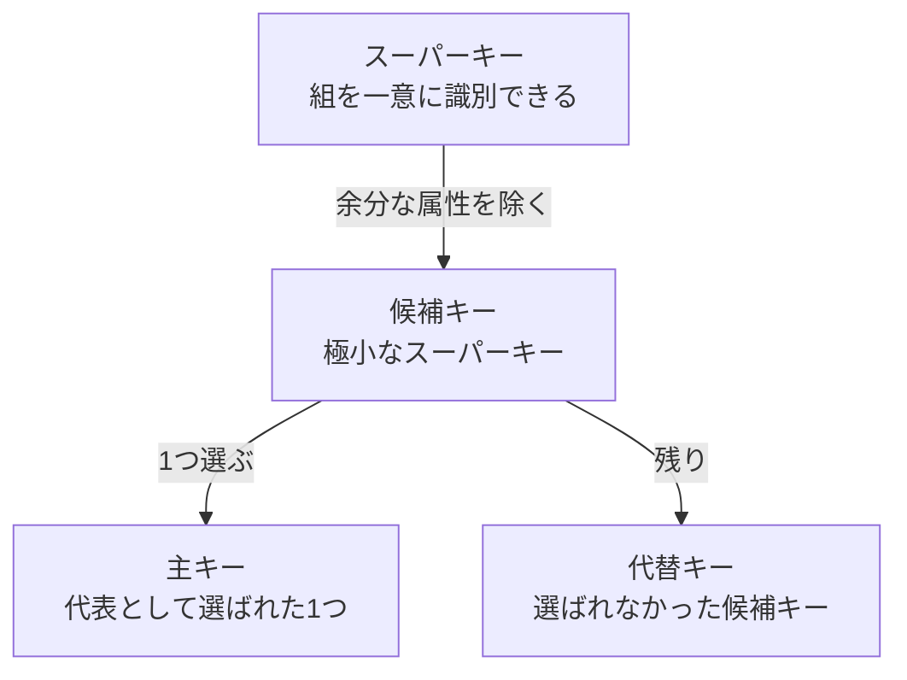
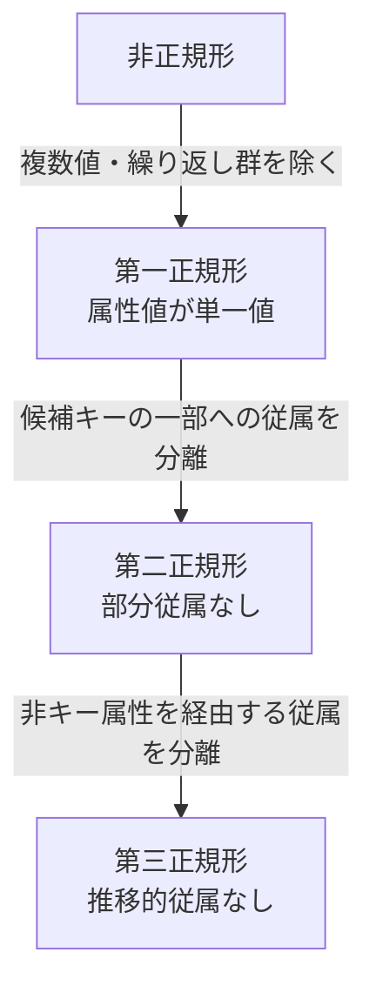
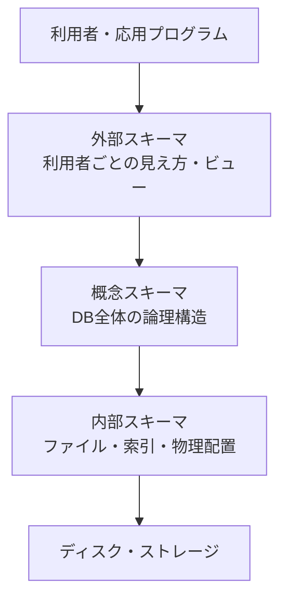

# 最初に見る超要約

| 範囲 | 一言 |
|---|---|
| ERモデル | 現実世界を「実体・属性・関連」で概念化する |
| 関係モデル | データを組（タプル）の集合で表す |
| 関係代数 | 関係を入力し、別の関係を出力する |
| 正規化 | 関数従属性に従って関係を分解し、組更新時異常を減らす |
| SQL | 欲しい結果の条件を書く宣言型言語 |
| ビュー・データ独立性 | 利用者の見え方とDBの論理・物理構造を分離する |

## このカンペを使った総復習ルート

時間に合わせて、次の順で使う。

| 残り時間 | 読む場所 |
|---|---|
| 10分 | 「最初に見る超要約」→「試験直前の最終チェック」 |
| 30分 | 各章の表・式・「頻出ミス」→末尾の総合例題 |
| 60分以上 | 第1章から順に例を手で追い、総合例題を解いてから解答を見る |

各章で説明できるようにすること：

1. ER図から関係スキーマへ変換できる。
2. キーの包含関係と整合性制約を説明できる。
3. 日本語の要求を関係代数式にできる。
4. FDを列挙し、第三正規形まで分解できる。
5. SQLを読み書きし、`GROUP BY`や相関副問い合わせを追える。
6. 3層スキーマと2種類のデータ独立性を事例で判定できる。

## 絶対に混同しないもの

| 混同しやすい組 | 正しい区別 |
|---|---|
| ERの関連 / 関係モデルの関係 | relationship＝関連、relation＝関係 |
| 属性 / 組 | 属性＝列、組＝行 |
| 次数 / 濃度 | 次数＝列数、濃度＝行数 |
| 選択 / 射影 | 選択$\sigma$＝行、射影$\pi$＝列 |
| スーパーキー / 候補キー | 候補キー＝極小なスーパーキー |
| 完全従属 / 部分従属 | 複合決定項の一部を除いても決まるなら部分従属 |
| WHERE / HAVING | WHERE＝グループ化前の行、HAVING＝グループ化後の群 |
| 論理的 / 物理的データ独立性 | 概念変更を外部から隠す / 内部変更を概念から隠す |

---

# 第1章 データモデルとERモデル

## データモデル

現実世界の対象・性質・結びつきを、データとして表現するための枠組み。

```text
現実世界
  ↓ 抽象化
概念モデル（ERモデルなど）
  ↓ DBで扱える形へ
論理モデル（関係データモデルなど）
```

- **概念モデル**：現実世界を、実装から離れて表す。
- **論理モデル**：DBMSで扱える論理構造として表す。

## ERモデル（Entity-Relationship model）

Peter Chen記法の基本。

| 要素 | 意味 | Chen記法 |
|---|---|---|
| 実体集合 | 同種の実体の集合 | 長方形 |
| 関連 | 実体集合間の結びつき | ひし形 |
| 属性 | 実体・関連が持つ性質 | 楕円 |
| キー属性 | 実体を識別する属性 | 属性名に下線 |

### 実体と実体集合

- 実体：具体的な1個（例：学籍番号S01の田中）
- 実体集合：同種の実体全体（例：学生）

### 属性・定義域・キー

- 属性：実体が持つ項目（学籍番号、氏名、学年）
- 定義域：属性が取り得る値の集合
- キー：実体を一意に識別する属性または属性集合

例：

$$
\text{学年の定義域}=\{1,2,3,4\}
$$

## 関連と多重度

| 多重度 | 意味 | 例 |
|---|---|---|
| 1:1 | 両側が最大1個ずつ対応 | 人と、その人専用の個人番号 |
| 1:N | 一方の1個に他方が複数対応 | 学部と学生 |
| M:N | 両側が複数対応 | 学生と科目（履修） |

向きを明記する。

$$
\text{学部}:\text{学生}=1:N
$$

$$
\text{学生}:\text{科目}=M:N
$$

### 関連の属性

成績は学生だけでも科目だけでも決まらない。「どの学生がどの科目を履修したか」ごとに決まる。

```text
学生 ── 履修 ── 科目
          │
         成績
```

したがって、成績は関連「履修」の属性。

## is-a関連

下位型が上位型の一種である関係。継承に近い。

```text
人
├── 学生
└── 教員
```

- 学生 is-a 人
- 教員 is-a 人
- 「人 is-a 学生」ではない（すべての人が学生になってしまう）

## ERモデルから関係モデルへの変換

| ERモデル | 関係モデル |
|---|---|
| 実体集合 | 関係（表） |
| 実体 | 組（行） |
| 属性 | 属性（列） |
| 1:N関連 | N側に外来キーを置く |
| M:N関連 | 関連を独立した関係にする |

例：

```text
学生（学籍番号, 氏名）
科目（科目番号, 科目名）
履修（学籍番号, 科目番号, 成績）
```

履修の候補キーは通常、

$$
\{\text{学籍番号},\text{科目番号}\}
$$

---

# 第2章 関係データモデル

## 基本用語

| 関係モデル | SQLでの呼び方 | 表での見方 |
|---|---|---|
| 関係（relation） | 表（table） | 表全体 |
| 属性（attribute） | 列（column） | 列 |
| 組（tuple） | 行（row） | 1件分の行 |
| 定義域（domain） | データ型・制約 | その列が取れる値 |

関係は、同じ属性を持つ組の**集合**。

```text
学生（学籍番号, 氏名, 学年）     ← 関係スキーマ
(S01, 田中, 2)                    ← 1個の組
現在格納されている組全体          ← 関係インスタンス
```

### 次数と濃度

$$
\text{次数}=\text{属性数（列数）}
$$

$$
\text{濃度}=\text{組数（行数）}
$$

## 関係の重要な性質

- 関係では組の順序に意味はない。
- 属性の順序も本質的ではない。
- 同一の組は重複しない（集合）。
- SQLの表は重複行を許すため、厳密には**マルチ集合**として振る舞う。
- SQLで重複を消すには`DISTINCT`を使う。

## キー

### スーパーキー

関係内の各組を一意に識別できる属性集合。余分な属性を含んでもよい。

```text
学生（学籍番号, 氏名, 学部）

{学籍番号}                 スーパーキー
{学籍番号, 氏名}           スーパーキー
{学籍番号, 氏名, 学部}     スーパーキー
```

### 候補キー

**極小なスーパーキー**。属性を1個でも取り除くと一意性を失う。

「極小」は、単に属性数が少ないという意味ではない。

### 主キー・代替キー

- 主キー：候補キーから代表として1つ選ぶ。
- 代替キー：主キーに選ばれなかった候補キー。
- 複合キー：複数属性からなるキー。

```text
スーパーキー
    ↓ 極小なもの
候補キー
    ↓ 代表を1つ
主キー

残った候補キー＝代替キー
```



### 関係によってキーは変わる

```text
学生（学籍番号, 氏名）
→ {学籍番号}で学生を識別

履修（学籍番号, 科目番号, 成績）
→ {学籍番号, 科目番号}で1件の履修を識別
```

同じ学生が複数科目を履修するので、履修関係では学籍番号だけでは一意にならない。

## 外来キー（外部キー）

別の関係の候補キー（通常は主キー）を参照する属性。

```text
学部（学部番号, 学部名）
学生（学籍番号, 氏名, 学部番号）

学生.学部番号 ──→ 学部.学部番号
```

## 整合性制約

| 制約 | 防ぐこと |
|---|---|
| キー制約 | 候補キーの重複 |
| 実体整合性制約 | 主キーがNULLになること |
| 参照整合性制約 | 外来キーが存在しない参照先を指すこと |

## NULL（空値）

NULLは0、空文字、空白文字ではない。

```text
NULL ≠ 0
NULL ≠ ""
NULL ≠ " "
```

NULLは「不明」「未登録」「適用不能」など、通常の値が存在しない状態。

```sql
電話番号 IS NULL
電話番号 IS NOT NULL
```

`電話番号 = NULL`ではない。NULLとの比較結果は通常の真偽では確定しない。

---

# 第3章 関係代数

## 基本

関係を入力し、新しい関係を出力する演算体系。出力も関係なので合成できる。

$$
\text{関係}\xrightarrow{\text{関係代数演算}}\text{関係}
$$

## 演算一覧

| 演算 | 記号 | 意味 |
|---|---:|---|
| 選択 | $\sigma$ | 条件に合う行を取る |
| 射影 | $\pi$ | 必要な列を取る（重複組は除去） |
| 和 | $\cup$ | 両方の関係の組を合わせる |
| 差 | $-$ | 左にあり右にない組 |
| 直積 | $\times$ | 全組合せ |
| 共通部分 | $\cap$ | 両方にある組 |
| 結合 | $\bowtie$ | 条件に合う組同士を合わせる |
| 商 | $\div$ | 「すべて」を満たす対象 |
| 名前変更 | $\rho$ | 関係名・属性名を変更 |

### 選択と射影

3年生の行：

$$
\sigma_{\scriptstyle \text{学年}=3}(\text{学生})
$$

学籍番号と氏名の列：

$$
\pi_{\scriptstyle \text{学籍番号},\,\text{氏名}}(\text{学生})
$$

情報学部学生の氏名：

$$
\pi_{\scriptstyle \text{氏名}}
\left(
  \sigma_{\scriptstyle \text{学部}=\text{`情報'}}(\text{学生})
\right)
$$

### 和両立

和・差・共通部分を行う基本条件：

- 次数が同じ。
- 対応する属性の定義域が同じ。

差には向きがある。

$$
R-S\neq S-R
$$

### 直積

$$
|R\times S|=|R|\times|S|
$$

## 結合

### $\theta$結合

比較条件$\theta$を指定する一般的な条件付き結合。`=`も含む。

$$
=,\neq,<,>,\leq,\geq
$$

$$
R\bowtie_{\scriptstyle \theta}S
=
\sigma_{\scriptstyle \theta}(R\times S)
$$

### 等結合

$\theta$結合のうち、結合条件が等号のもの。

$$
\text{等結合}\subseteq\theta\text{結合}
$$

### 自然結合

同名属性の値が等しい組を自動的に結合し、共通属性を結果では1列にする。

```text
履修（学籍番号, 科目番号, 成績）
科目（科目番号, 科目名）
```

$$
\text{履修}\bowtie\text{科目}
$$

結果の属性：

```text
（学籍番号, 科目番号, 成績, 科目名）
```

### 自然結合の注意点

1. 一致する相手がない組は消える（内部結合）。
2. 同名だが意味の違う属性まで結合条件になる。
3. 共通属性がない自然結合は直積と同じになる。
4. 片側が共通属性しか持たなければ、実質的に存在確認・絞り込みになる。

### 外部結合

一致する相手がない組も残し、相手側の属性をNULLで補う。

- 左外部結合：左側をすべて残す。
- 右外部結合：右側をすべて残す。
- 完全外部結合：両側をすべて残す。

## 商演算

「$S$の**すべて**の値と対応する対象」を求める。

```text
履修（学生名, 科目名） ÷ 必修科目（科目名）
→ 必修科目をすべて履修した学生名
```

余分な科目を履修していても構わない。

## 名前変更

関係$R$を$S$へ変更：

$$
\rho_{\scriptstyle S}(R)
$$

同じ社員関係を部下役・上司役に分ける：

$$
\rho_{\scriptstyle \text{部下}}(\text{社員})
$$

$$
\rho_{\scriptstyle \text{上司}}(\text{社員})
$$

自己結合：

$$
\text{部下}
\bowtie_{\scriptstyle \text{部下.上司番号}=\text{上司.社員番号}}
\text{上司}
$$

## 式を書く順序

「工学部学生の学籍番号と氏名」なら、内側から結合→選択→射影。

$$
\pi_{\scriptstyle \text{学籍番号},\,\text{氏名}}
\left(
  \sigma_{\scriptstyle \text{学部名}=\text{`工学部'}}
  \left(
    \text{学生}\bowtie\text{学部}
  \right)
\right)
$$

---

# 第4章 関数従属性と正規化

## 正規化の目的

不必要なデータ重複を減らし、**組更新時異常**を防ぐ。

### 組更新時異常の分類

```text
組更新時異常（Update Anomaly）
├── 組挿入時異常
├── 組削除時異常
└── 組修正時異常
```

| 異常 | 内容 |
|---|---|
| 組挿入時異常 | 他の情報がないため、必要な事実だけを登録できない |
| 組削除時異常 | 組を削除すると、残したい別の事実まで失う |
| 組修正時異常 | 同じ事実を全箇所で修正しないと矛盾する |

「組更新時異常」を「組修正時異常」と並列にしない。前者が総称。

## 第一正規形（1NF）

各属性値が、そのDBで単一の値として扱われる状態。1セルに集合・配列・繰り返し群を入れない。

```text
電話番号 = {"090...", "080..."}  ← 1NFでない
```

1NFへ：

```text
連絡先（学籍番号, 電話番号）
(S01, 090...)
(S01, 080...)
```

### 「繰り返し」の区別

- 禁止：1つの組・セルの中に複数値を埋め込む。
- 許容：非キー値が複数行で同じになる。
- キー制約違反：キー**全体**が複数行で同じになる。

第一正規形は重複をすべて消す段階ではない。まず、各行を独立した平坦な組にする段階。

## 関数従属性（FD）

$$
X\to Y
$$

読み方：

- $X$が$Y$を関数的に決定する。
- $Y$は$X$に関数従属する。

| 左右 | 名称 |
|---|---|
| $X$ | 決定項 |
| $Y$ | 従属項 |

意味：

> $X$の値が同じなら、$Y$の値も必ず同じ。

任意の2組$t_1,t_2$について、

$$
t_1[X]=t_2[X]\Rightarrow t_1[Y]=t_2[Y]
$$

例：

$$
\text{学籍番号}\to\text{学生名}
$$

同姓同名があり得るなら逆は成立しない。

$$
\text{学生名}\not\to\text{学籍番号}
$$

## 完全従属と部分従属

候補キーが、

$$
\{\text{学籍番号},\text{科目番号}\}
$$

のとき、成績は両方が必要。

$$
\{\text{学籍番号},\text{科目番号}\}\to\text{成績}
$$

$$
\text{学籍番号}\not\to\text{成績}
$$

$$
\text{科目番号}\not\to\text{成績}
$$

よって成績は複合キーに**完全従属**。

一方、

$$
\text{学籍番号}\to\text{学生名}
$$

なので、学生名は複合キーの一部だけで決まり、**部分従属**。

単一属性の候補キーは、非空な「キーの一部」へ分解できないので部分従属を生じない。

## 推移的従属

$$
X\to Y,\quad Y\to Z
$$

なら、

$$
X\to Z
$$

例：

$$
\text{学籍番号}
\to\text{学部番号}
\to\text{学部名}
$$

学部名は学籍番号に推移的に従属する。

## 正規形の判断

| 正規形 | 条件 |
|---|---|
| 1NF | 属性値が単一値 |
| 2NF | 1NFかつ、非キー属性が候補キーに部分従属しない |
| 3NF | 2NFかつ、非キー属性が候補キーに推移的に従属しない |

```text
非正規形
  ↓ 複数値・繰り返し群を平坦化
第一正規形
  ↓ 部分従属を分離
第二正規形
  ↓ 推移的従属を分離
第三正規形
```



## 正規化の典型問題

元：

```text
履修情報
（学籍番号, 学生名, 科目番号, 科目名,
  教員番号, 教員名, 成績）
```

候補キー：

$$
\{\text{学籍番号},\text{科目番号}\}
$$

FD：

$$
\text{学籍番号}\to\text{学生名}
$$

$$
\text{科目番号}\to\{\text{科目名},\text{教員番号}\}
$$

$$
\text{教員番号}\to\text{教員名}
$$

$$
\{\text{学籍番号},\text{科目番号}\}\to\text{成績}
$$

第三正規形への分解：

```text
学生（学籍番号, 学生名）
教員（教員番号, 教員名）
科目（科目番号, 科目名, 教員番号）
履修（学籍番号, 科目番号, 成績）
```

重要：分解時に結び付きを失わない。

- 科目に教員番号を残す。
- 履修に学籍番号・科目番号を残す。
- 「どの学生がどの学部か」を残すなら、学生に学部番号を残す。

## アームストロングの公理系

| 規則 | 形式 |
|---|---|
| 反射律 | $Y\subseteq X\Rightarrow X\to Y$ |
| 増加律 | $X\to Y\Rightarrow XZ\to YZ$ |
| 推移律 | $X\to Y,\;Y\to Z\Rightarrow X\to Z$ |

例（反射律）：

$$
\{A,B,C\}\to\{A,C\}
$$

### 属性閉包

$X^+$は、FD集合から$X$が決定できる全属性の集合。$X$自身も含む。

$$
F=\{A\to B,\;B\to C,\;C\to D\}
$$

なら、

$$
A^+=\{A,B,C,D\}
$$

候補キー判定では、$X^+$が関係の全属性を含むかを見る。さらに極小性を確認する。

---

# 第5章 SQL

## SQLの特徴

- 関係DBを検索・登録・更新する言語。
- ISO標準だが、DB製品ごとの拡張がある。
- **宣言型言語**：処理手順（How）でなく、欲しい結果（What）を書く。
- 関係代数を基礎にするが、集約などを拡張している。
- SQLの表は重複行を許すマルチ集合。

## 基本構文と概念的な解釈

```sql
SELECT <列>
FROM <表>
WHERE <条件>;
```

概念上の順序：

```text
FROM：表の直積・結合
  ↓
WHERE：行の選択
  ↓
SELECT：列の射影
```

関係代数との対応：

| SQL | 関係代数 |
|---|---|
| `WHERE` | 選択$\sigma$ |
| `SELECT 列` | 射影$\pi$ |
| `CROSS JOIN` | 直積$\times$ |
| `JOIN ... ON` | $\theta$結合 |
| `NATURAL JOIN` | 自然結合 |
| `UNION` | 和$\cup$ |
| `INTERSECT` | 共通部分$\cap$ |
| `EXCEPT` | 差$-$ |
| `AS`・表別名 | 名前変更$\rho$ |

## 基本検索

```sql
SELECT 学籍番号, 氏名
FROM 学生
WHERE 学年 >= 2
  AND 学部番号 = 'D01';
```

注意：

```text
2である      = 2
2より大きい  > 2
2以上        >= 2
文字列       'D01' のようにクォート
```

重複除去：

```sql
SELECT DISTINCT 学部番号
FROM 学生;
```

NULL：

```sql
WHERE 電話番号 IS NULL
WHERE 電話番号 IS NOT NULL
```

パターン：

```sql
WHERE 氏名 LIKE '田%'
```

- `%`：0文字以上の任意文字列
- `_`：任意の1文字

並べ替え：

```sql
ORDER BY 学年 DESC, 氏名 ASC;
```

左に書いた列が第1キー。`ASC`は昇順、`DESC`は降順。

## 結合

```sql
SELECT 学生.学籍番号, 学生.氏名, 学部.学部名
FROM 学生
JOIN 学部
  ON 学生.学部番号 = 学部.学部番号;
```

自然結合：

```sql
SELECT 学籍番号, 氏名, 学部名
FROM 学生 NATURAL JOIN 学部;
```

自然結合は同名属性をすべて使うため、意図しない同名属性に注意。

## 自己結合と別名

同じ都市にある異なる供給元のペア：

```sql
SELECT FIRST.S#, SECOND.S#
FROM S FIRST, S SECOND
WHERE FIRST.SCITY = SECOND.SCITY
  AND FIRST.S# > SECOND.S#;
```

`>`により、

- 自分自身とのペアを除く。
- `(s1,s2)`と`(s2,s1)`の逆順重複を片方だけにする。

SQLの1行コメントは通常`--`。`//`ではない。

## 入れ子型質問

部品番号`p2`を供給する供給元名：

```sql
SELECT SNAME
FROM S
WHERE S# IN (
  SELECT S#
  FROM SP
  WHERE P# = 'p2'
);
```

`p2`が部品番号なら`P# = 'p2'`。部品名を探すなら`P`表と`PNAME`が必要。

二重の入れ子（赤い部品を供給する供給元）：

```sql
SELECT SNAME
FROM S
WHERE S# IN (
  SELECT S#
  FROM SP
  WHERE P# IN (
    SELECT P#
    FROM P
    WHERE COLOR = 'Red'
  )
);
```

## 相関入れ子質問

内側の問い合わせが、外側の現在の行を参照する。

```sql
SELECT SNAME
FROM S
WHERE EXISTS (
  SELECT *
  FROM SP
  WHERE SP.S# = S.S#
    AND SP.P# = 'p2'
);
```

外側の各`S`行について、対応する`SP`行が存在するか評価する。

`EXISTS (SELECT ...)`は、内側の結果が1行以上なら真。

## 集約関数

| 関数 | 意味 |
|---|---|
| `COUNT(*)` | NULLを含め、行数を数える |
| `COUNT(列)` | その列がNULLでない行を数える |
| `SUM` | 合計 |
| `AVG` | 平均（`AVE`ではない） |
| `MAX` | 最大 |
| `MIN` | 最小 |

```sql
SELECT
  AVG(成績) AS 平均成績,
  MAX(成績) AS 最高成績,
  MIN(成績) AS 最低成績
FROM 履修;
```

## GROUP BYとHAVING

科目ごとに行を箱詰めし、各箱から1行の集約結果を作る。

```text
C01 → [80, 70, 90] → 平均80
C02 → [60, 80]     → 平均70
```

```sql
SELECT 科目番号, AVG(成績) AS 平均成績
FROM 履修
GROUP BY 科目番号;
```

グループ化後に`SELECT`できるのは原則：

- `GROUP BY`に指定した列
- 集約関数の結果

### WHEREとHAVING

```sql
SELECT 科目番号, AVG(成績) AS 平均成績
FROM 履修
WHERE 成績 >= 60
GROUP BY 科目番号
HAVING AVG(成績) >= 80;
```

```text
FROM
 ↓
WHERE       行を絞る
 ↓
GROUP BY   グループ化
 ↓
HAVING     グループを絞る
 ↓
SELECT
 ↓
ORDER BY
```

件数には`COUNT(*)`を使う。`SUM(*)`ではない。

## 集合演算

```sql
SELECT P#
FROM P
WHERE WEIGHT > 18
UNION
SELECT P#
FROM SP
WHERE S# = 's2';
```

`UNION`は重複を除去する和。問い合わせ同士の列数と対応する型をそろえる。

## 更新操作

追加：

```sql
INSERT INTO P
VALUES ('p7', 'Washer', 'Grey', 2, 'Athens');
```

検索結果を別表へ追加：

```sql
INSERT INTO TEMP
SELECT P#
FROM SP
WHERE S# = 's2';
```

修正：

```sql
UPDATE S
SET STATUS = 2 * STATUS
WHERE SCITY = 'London';
```

削除：

```sql
DELETE FROM S
WHERE S# = 's1';
```

`UPDATE`・`DELETE`で`WHERE`を省略すると全行が対象。`DELETE FROM SP;`は行を全削除するが表の枠組みは残る。

---

# 第6章 ビュー・3層スキーマ・データ独立性

## 3層スキーマ



| 層 | 内容 | 例 |
|---|---|---|
| 外部スキーマ | 利用者・アプリごとの見え方 | 教員用成績一覧、事務用住所一覧 |
| 概念スキーマ | DB全体の論理構造 | 関係、属性、キー、整合性制約 |
| 内部スキーマ | 物理的な格納・アクセス方法 | ファイル、B木、ハッシュ、配置 |

外側から、

```text
外部 → 概念 → 内部
```

## データ独立性

基本は、**下位層を変更しても上位層への影響を抑える**性質。

```text
外部スキーマ
      ↑ 論理的データ独立性
概念スキーマ
      ↑ 物理的データ独立性
内部スキーマ
```

### 物理的データ独立性

内部スキーマを変更しても、概念スキーマやSQLを変更しなくてよい。

例：

- インデックスを追加・変更する。
- レコード配置を変える。
- HDDからSSDへ移す。
- ファイルの保存場所を変える。

同じSQLのまま、DBMSがより効率的なアクセス方法を選べる。

### 論理的データ独立性

概念スキーマを変更しても、外部スキーマや応用プログラムへの影響を抑える。

例：

```text
変更前：
学生情報（学籍番号, 氏名, 学部名）

変更後：
学生（学籍番号, 氏名, 学部番号）
学部（学部番号, 学部名）
```

以前と同じ形のビューを提供：

```sql
CREATE VIEW 学生情報 AS
SELECT 学籍番号, 氏名, 学部名
FROM 学生 NATURAL JOIN 学部;
```

## ビュー

SQL問い合わせの結果を仮想的な表として見せるもの。

```sql
CREATE VIEW 合格者 AS
SELECT 学籍番号, 科目番号, 成績
FROM 履修
WHERE 成績 >= 60;
```

利用：

```sql
SELECT *
FROM 合格者;
```

### 実表との違い

- 実表：実際のデータを保持する。
- 通常のビュー：問い合わせ定義を保持し、参照時に現在の実表から結果を得る。

実表の氏名を更新すれば、ビューには更新後の氏名が現れる。ビュー条件を満たす限り、その行自体は消えない。

## ビューの利用目的

### 1. 複雑なSQLの簡略化

結合・集約・入れ子をビューに隠し、利用側を単純にする。

### 2. 機密保持・アクセス制御

```sql
CREATE VIEW 社員公開情報 AS
SELECT 社員番号, 氏名, 部署名
FROM 社員;
```

給与・誕生日などを隠せる。ただし、実表への権限を与えず、ビューへの権限だけを与える必要がある。

```sql
GRANT SELECT ON EMPVIEW TO generic;
```

### 3. 計算によって確定する属性

誕生日を直接見せず、現在日付から計算した年齢だけを見せる、といった使い方。

### 4. 論理的データ独立性

表の分割・改名後も、以前と同じ名前・列構造のビューを作り、古い応用プログラムを継続利用しやすくする。

## ビュー更新問題

一般に、複数表の結合などで作ったビューは更新できないことがある。

理由：ビューの1行を変更・削除するとき、元のどの実表のどの行を変更すべきか一意に決められない場合がある。

```text
供給表 ⋈ 需要表 → 取引ビュー

取引ビューの1行を削除
→ 供給表を消すのか？
→ 需要表を消すのか？
→ 両方か？
```

「ビューは表のように検索できる」ことと、「常に表と同じように更新できる」ことは別。

---

# 試験直前の最終チェック

## 10秒定義

1. 候補キー：極小なスーパーキー。
2. 外来キー：別の関係のキーを参照する属性。
3. 選択：条件に合う行。
4. 射影：必要な列。
5. 自然結合：同名属性で等結合し、共通属性を1列にする。
6. $X\to Y$：$X$が同じなら$Y$も同じ。
7. 2NF：部分従属なし。
8. 3NF：推移的従属なし。
9. ビュー：問い合わせ結果を仮想表として見せる。
10. データ独立性：下位構造の変更を上位から隠す。

## 頻出ミス

- `X→Y`は「**YがXに**従属」。
- 候補キーは極小。スーパーキーは余分な属性を含んでよい。
- 履修のキーは通常、学籍番号だけでなく`{学籍番号, 科目番号}`。
- 非キー値の行間重複は、直ちにキー制約違反ではない。
- 第1正規形は「重複ゼロ」ではなく「1セル1値・独立した組」。
- 組更新時異常は、挿入・削除・修正の総称。
- $\theta$結合には等号も含む。等結合はその一部。
- 自然結合では一致しない組が消える。
- SQLの文字列は`'...'`。
- `AVG`であり`AVE`ではない。
- `COUNT(*)`は行数、`SUM`は値の合計。
- 降順は`DESC`であり`DISC`ではない。
- NULLは`IS NULL`。
- ビューの元表を更新すると、通常のビューの表示にも反映される。
- 外部→概念→内部。下位変更を上位から隠す。

## 記述問題の型

### 関数従属性

> $X$の値が同じであれば$Y$の値も必ず同じになるため、$X\to Y$が成立する。したがって、$X$は決定項、$Y$は従属項である。

### 第2正規形でない理由

> 候補キーは$\{A,B\}$であるが、非キー属性$C$について$A\to C$が成立する。$C$は候補キーの一部に部分従属するため、第2正規形ではない。

### 第3正規形でない理由

> $A\to B$かつ$B\to C$が成立し、非キー属性$C$が候補キー$A$に推移的に従属するため、第3正規形ではない。

### 物理的データ独立性

> インデックスやファイル配置などの内部スキーマを変更しても、概念スキーマとSQLを変更せず利用できる性質である。

### 論理的データ独立性

> 関係の分割・改名など概念スキーマを変更しても、ビュー等によって従来の外部スキーマを保ち、応用プログラムへの影響を抑える性質である。

---

# 総合例題

先に問題だけを解き、その後の解答で確認する。

## 例題1 ERモデルから関係モデルへ

次の条件を関係スキーマに変換せよ。

- 学生は学籍番号と氏名を持つ。
- 科目は科目番号と科目名を持つ。
- 学生は複数科目を履修でき、科目も複数学生に履修される。
- 成績は履修ごとに決まる。

### 解答

学生と科目はM:N関連なので、履修を独立した関係にする。

```text
学生（学籍番号, 氏名）
科目（科目番号, 科目名）
履修（学籍番号, 科目番号, 成績）
```

キー：

```text
学生：学籍番号
科目：科目番号
履修：{学籍番号, 科目番号}
```

履修の学籍番号・科目番号は、それぞれ学生・科目を参照する外来キーでもある。

## 例題2 キーを判定する

```text
社員（社員番号, メールアドレス, 氏名, 部署番号）
```

社員番号とメールアドレスは、それぞれ単独で社員を一意に識別できる。社員番号を主キーに選んだ場合、候補キー・代替キー・スーパーキーの例を答えよ。

### 解答

```text
候補キー：
{社員番号}
{メールアドレス}

主キー：
{社員番号}

代替キー：
{メールアドレス}

スーパーキーの例：
{社員番号, 氏名}
{メールアドレス, 部署番号}
```

後ろ2つは一意性を持つが、余分な属性を含むので候補キーではない。

## 例題3 関係代数式

```text
学生（学籍番号, 氏名, 学部番号）
学部（学部番号, 学部名）
```

情報学部に所属する学生の学籍番号と氏名を求めよ。

### 解答

$$
\pi_{\scriptstyle \text{学籍番号},\,\text{氏名}}
\left(
  \sigma_{\scriptstyle \text{学部名}=\text{`情報学部'}}
  \left(
    \text{学生}\bowtie\text{学部}
  \right)
\right)
$$

内側から、

```text
自然結合 → 学部名で選択 → 学籍番号・氏名を射影
```

と評価する。

## 例題4 第三正規形まで分解する

```text
受講
（学籍番号, 学生名, 科目番号, 科目名,
  教員番号, 教員名, 成績）
```

候補キーとFD：

$$
\text{候補キー}=
\{\text{学籍番号},\text{科目番号}\}
$$

$$
\text{学籍番号}\to\text{学生名}
$$

$$
\text{科目番号}\to
\{\text{科目名},\text{教員番号}\}
$$

$$
\text{教員番号}\to\text{教員名}
$$

$$
\{\text{学籍番号},\text{科目番号}\}\to\text{成績}
$$

第三正規形まで分解せよ。

### 解答

部分従属：

$$
\text{学籍番号}\to\text{学生名}
$$

$$
\text{科目番号}\to
\{\text{科目名},\text{教員番号}\}
$$

推移的従属：

$$
\text{科目番号}\to\text{教員番号}\to\text{教員名}
$$

分解結果：

```text
学生（学籍番号, 学生名）
教員（教員番号, 教員名）
科目（科目番号, 科目名, 教員番号）
受講（学籍番号, 科目番号, 成績）
```

`科目.教員番号`を残さないと、科目と教員の対応が失われる。

## 例題5 GROUP BYとHAVING

```text
履修（学籍番号, 科目番号, 成績）
```

60点以上の履修だけを対象に科目ごとの平均を求め、平均80点以上の科目を平均の高い順で表示せよ。

### 解答

```sql
SELECT
  科目番号,
  AVG(成績) AS 平均成績
FROM 履修
WHERE 成績 >= 60
GROUP BY 科目番号
HAVING AVG(成績) >= 80
ORDER BY 平均成績 DESC;
```

評価の流れ：

```text
WHEREで60点未満の行を除く
→ 科目番号でグループ化
→ AVGを計算
→ HAVINGで平均80以上の群を残す
→ 平均の降順
```

## 例題6 自己結合

```text
S（S#, SNAME, STATUS, SCITY）
```

同じ都市にある異なる供給元の番号ペアを、逆順重複なしで求めよ。

### 解答

```sql
SELECT FIRST.S#, SECOND.S#
FROM S FIRST
JOIN S SECOND
  ON FIRST.SCITY = SECOND.SCITY
WHERE FIRST.S# > SECOND.S#;
```

`FIRST.S# > SECOND.S#`により、

- 同一供給元どうしを除く。
- 逆順ペアを片方だけにする。

## 例題7 相関副問い合わせ

```text
S（S#, SNAME, STATUS, SCITY）
SP（S#, P#, QTY）
```

部品`p2`を供給している供給元名を`EXISTS`で求めよ。

### 解答

```sql
SELECT SNAME
FROM S
WHERE EXISTS (
  SELECT *
  FROM SP
  WHERE SP.S# = S.S#
    AND SP.P# = 'p2'
);
```

内側の`S.S#`は、外側で現在評価中の供給元の番号を参照する。外側の各供給元について、対応する`SP`行が1行以上あれば`EXISTS`が真になる。

## 例題8 ビューと論理的データ独立性

以前は次の関係をアプリが利用していた。

```text
学生情報（学籍番号, 氏名, 学部名）
```

正規化後：

```text
学生（学籍番号, 氏名, 学部番号）
学部（学部番号, 学部名）
```

古いアプリを維持する方法を答えよ。

### 解答

```sql
CREATE VIEW 学生情報 AS
SELECT 学籍番号, 氏名, 学部名
FROM 学生 NATURAL JOIN 学部;
```

概念スキーマは変更されたが、以前と同じ外部スキーマをビューで提供できる。これがビューによる論理的データ独立性の実現例。

## 例題9 変更を分類する

次の変更を分類せよ。

| 変更 | 解答 |
|---|---|
| B木インデックスを追加 | 内部スキーマ・物理的変更 |
| HDDからSSDへ移動 | 内部スキーマ・物理的変更 |
| 1関係を2関係に分割 | 概念スキーマ・論理的変更 |
| 関係へ新しい属性を追加 | 概念スキーマ・論理的変更 |
| 教員向けビューを追加 | 外部スキーマ |

内部スキーマの変更を概念スキーマから隠すのが物理的データ独立性。概念スキーマの変更を外部スキーマから隠すのが論理的データ独立性。

## 例題10 誤りを直す

次を訂正せよ。

```text
1. X→Yは、XがYに従属する
2. 候補キーは一意なら余分な属性を含んでよい
3. 第一正規形では同じ値を複数行に書けない
4. θ結合は等号以外を使う結合
5. WHERE AVG(成績) >= 80
6. 電話番号 = NULL
7. SELECT AVE(成績)
8. ORDER BY 成績 DISC
```

### 解答

```text
1. YがXに関数従属する
2. スーパーキーは余分な属性を含んでよい。候補キーは極小
3. 禁止されるのは1セル内の複数値・繰り返し群
4. θ結合は等号を含む一般的な比較条件による結合
5. HAVING AVG(成績) >= 80（グループを絞る場合）
6. 電話番号 IS NULL
7. SELECT AVG(成績)
8. ORDER BY 成績 DESC
```

---

# 試験基準演習：関係代数とSQL

講義で繰り返し扱われた供給元データベースを使う。まず問題を関係代数で解き、その後にSQLで書き直せるようにする。

```text
S（S#, SNAME, STATUS, SCITY）
P（P#, PNAME, COLOR, WEIGHT, PCITY）
SP（S#, P#, QTY）
```

- `S`：供給元
- `P`：部品
- `SP`：供給元と部品の現在の供給関係

## 試験問題1 現在供給されている部品

誰かによって供給されている部品番号を求めよ。

### 関係代数

$$
\pi_{\scriptstyle P\#}(SP)
$$

### SQL

```sql
SELECT DISTINCT P#
FROM SP;
```

### 採点ポイント

`P`ではなく`SP`を見る。`P`には現在供給されていない部品や廃盤部品も含まれ得るが、`SP`には実際の供給関係が記録される。

## 試験問題2 部品番号と供給元都市

誰かによって供給されている部品番号と、その供給元の所在都市を求めよ。

### 関係代数

$$
\pi_{\scriptstyle P\#,\,SCITY}
\left(
  SP\bowtie_{\scriptstyle SP.S\#=S.S\#}S
\right)
$$

### SQL

```sql
SELECT DISTINCT SP.P#, S.SCITY
FROM SP
JOIN S
  ON SP.S# = S.S#;
```

### 採点ポイント

- `SCITY`は部品`P`ではなく、供給元`S`の属性。
- 同じ部品・都市の組が複数供給元から出る可能性があるので`DISTINCT`を付ける。

## 試験問題3 同じ都市の供給元ペア

同じ都市にある相異なる供給元番号のペアを、逆順重複なしで求めよ。

### 関係代数

$$
\pi_{\scriptstyle FIRST.S\#,\,SECOND.S\#}
\left(
  \sigma_{\scriptstyle
    FIRST.SCITY=SECOND.SCITY
    \,\land\,
    FIRST.S\#>SECOND.S\#
  }
  \left(
    \rho_{\scriptstyle FIRST}(S)
    \times
    \rho_{\scriptstyle SECOND}(S)
  \right)
\right)
$$

### SQL

```sql
SELECT FIRST.S#, SECOND.S#
FROM S FIRST
JOIN S SECOND
  ON FIRST.SCITY = SECOND.SCITY
WHERE FIRST.S# > SECOND.S#;
```

### 採点ポイント

`FIRST.S# <> SECOND.S#`だけでは、

```text
(s1, s2)
(s2, s1)
```

が両方残る。`>`または`<`なら、自分自身と逆順重複を同時に除ける。講義で「よく引っかかる」と強調された問題。

## 試験問題4 部品p2を供給する供給元

部品`p2`を供給している供給元名を求めよ。

### 関係代数

$$
\pi_{\scriptstyle SNAME}
\left(
  \sigma_{\scriptstyle P\#=\text{`p2'}}
  \left(
    S\bowtie SP
  \right)
\right)
$$

### SQL：入れ子型

```sql
SELECT SNAME
FROM S
WHERE S# IN (
  SELECT S#
  FROM SP
  WHERE P# = 'p2'
);
```

### SQL：結合

```sql
SELECT DISTINCT SNAME
FROM S
NATURAL JOIN SP
WHERE P# = 'p2';
```

### 採点ポイント

`p2`は部品番号なので`P# = 'p2'`。`PNAME = 'p2'`ではない。

## 試験問題5 赤い部品を供給する供給元

赤い部品を少なくとも1種類供給している供給元名を求めよ。

### 関係代数

$$
\pi_{\scriptstyle SNAME}
\left(
  S
  \bowtie
  SP
  \bowtie
  \sigma_{\scriptstyle COLOR=\text{`Red'}}(P)
\right)
$$

### SQL

```sql
SELECT SNAME
FROM S
WHERE S# IN (
  SELECT S#
  FROM SP
  WHERE P# IN (
    SELECT P#
    FROM P
    WHERE COLOR = 'Red'
  )
);
```

### 処理順

```text
赤い部品のP#を求める
→ そのP#を供給するS#を求める
→ そのS#のSNAMEを求める
```

## 試験問題6 s2と共通の部品を供給する供給元

供給元`s2`が供給する部品のうち、少なくとも1つを供給している供給元番号を求めよ。

### 関係代数

$$
\pi_{\scriptstyle S\#}
\left(
  SP
  \bowtie
  \pi_{\scriptstyle P\#}
  \left(
    \sigma_{\scriptstyle S\#=\text{`s2'}}(SP)
  \right)
\right)
$$

### SQL

```sql
SELECT DISTINCT S#
FROM SP
WHERE P# IN (
  SELECT P#
  FROM SP
  WHERE S# = 's2'
);
```

### 注意

この条件では`s2`自身も結果に入り得る。問題が「s2以外」を要求するなら、外側に次を追加する。

```sql
AND S# <> 's2'
```

## 試験問題7 2社以上が供給する部品

2つ以上の異なる供給元によって供給されている部品番号を求めよ。

### SQL：GROUP BY

```sql
SELECT P#
FROM SP
GROUP BY P#
HAVING COUNT(*) > 1;
```

### SQL：相関入れ子質問

```sql
SELECT DISTINCT SPX.P#
FROM SP SPX
WHERE SPX.P# IN (
  SELECT P#
  FROM SP
  WHERE S# <> SPX.S#
);
```

### 相関の読み方

外側の現在の`SPX`行について、同じ部品を供給する別の`S#`の行が内側に存在するか調べる。

## 試験問題8 p2を供給していない供給元

部品`p2`を供給していない供給元名を求めよ。

### SQL：NOT EXISTS

```sql
SELECT SNAME
FROM S
WHERE NOT EXISTS (
  SELECT *
  FROM SP
  WHERE SP.S# = S.S#
    AND SP.P# = 'p2'
);
```

### SQL：NOT IN

```sql
SELECT SNAME
FROM S
WHERE S# NOT IN (
  SELECT S#
  FROM SP
  WHERE P# = 'p2'
);
```

### 引っかけ

単に、

```sql
SELECT SNAME
FROM S NATURAL JOIN SP
WHERE P# <> 'p2';
```

としてはいけない。ある供給元が`p2`と別部品の両方を供給していれば、別部品の行によって誤って結果に残る。

## 試験問題9 OR条件を集合演算で表す

重量が18より重い、または供給元`s2`によって供給されている部品番号を求めよ。

### 関係代数

$$
\pi_{\scriptstyle P\#}
\left(
  \sigma_{\scriptstyle WEIGHT>18}(P)
\right)
\cup
\pi_{\scriptstyle P\#}
\left(
  \sigma_{\scriptstyle S\#=\text{`s2'}}(SP)
\right)
$$

### SQL

```sql
SELECT P#
FROM P
WHERE WEIGHT > 18
UNION
SELECT P#
FROM SP
WHERE S# = 's2';
```

## 試験問題10 GROUP BYとHAVING

次の関係`R(A,B,C,D)`に対して、

```sql
SELECT B, AVG(C)
FROM R
GROUP BY B
HAVING SUM(D) >= 100;
```

の処理を説明せよ。

### 解答の型

1. `B`が同じ行をグループ化する。
2. 各グループで`SUM(D)`を計算する。
3. 合計が100以上のグループだけを残す。
4. 残った各グループについて`B`と`AVG(C)`を出力する。

## 仕上げチェック

以下を、何も見ずに書ければSQL・関係代数の試験対策としてかなり強い。

- `p2`を供給する供給元：結合版と入れ子版
- 赤い部品を供給する供給元：二重入れ子
- 2社以上が供給する部品：相関版と`GROUP BY`版
- `p2`を供給しない供給元：`NOT EXISTS`
- 同じ都市のペア：自己結合と`>`
- OR条件：和演算と`UNION`
